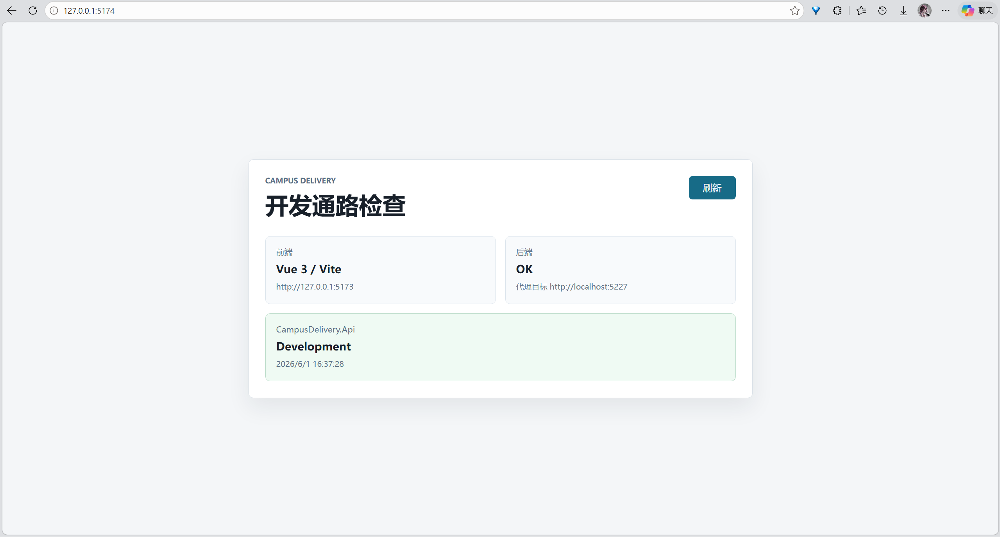

# Campus Delivery

校园中转分发与跑腿服务管理系统。仓库按全栈单仓库组织，后端由 Visual Studio 2022 打开，前端由 VS Code 打开。

<div style="text-align: center;">
  <p style="font-size: 0.8em; color: gray; margin-top: 5px;">如果看到这样的页面，说明你的环境配置成功了</p>
</div>

## 项目结构

```text
campus-delivery/
├─ backend/
│  ├─ CampusDelivery.sln
│  └─ src/
│     └─ CampusDelivery.Api/
├─ frontend/
│  ├─ package.json
│  ├─ vite.config.ts
│  └─ src/
├─ database/
│  └─ oracle/
│     └─ 001_schema.sql
├─ docs/
│  ├─ naming-conventions.md
│  └─ schema.dbml
├─ scripts/
├─ .editorconfig
├─ .env.example
└─ README.md
```

## 命名约定

- 仓库名：`campus-delivery`
- 后端 solution：`CampusDelivery.sln`
- 后端项目：`CampusDelivery.Api`
- C# 命名空间：`CampusDelivery.Api`
- 前端包名：`campus-delivery-web`
- 数据库脚本目录：`database/oracle`

更详细的约定见 [docs/naming-conventions.md](docs/naming-conventions.md)。

## 环境要求

- Visual Studio 2022，需安装 ASP.NET and web development 工作负载
- .NET SDK `9.0`
- VS Code
- Node.js `20.19.0` 或更高版本
- npm
- Oracle Database，建议本地 Oracle XE / 18c+

Windows PowerShell 如果直接运行 `npm` 报执行策略错误，可以使用 `npm.cmd`。

## 后端启动

用 Visual Studio 2022 打开：

```text
backend/CampusDelivery.sln
```

选择 `CampusDelivery.Api`，使用 `http` profile 启动。默认地址：

```text
http://localhost:5227
```

也可以命令行启动：

```powershell
cd backend/src/CampusDelivery.Api
dotnet restore
dotnet run
```

后端通路检查：

```text
http://localhost:5227/api/health
```

Oracle 连通性检查：

```text
http://localhost:5227/api/DbTest/ping
```

Oracle 连接串在：

```text
backend/src/CampusDelivery.Api/appsettings.json
```

默认值：

```json
{
  "ConnectionStrings": {
    "OracleDb": "User Id=APPUSER;Password=App123456;Data Source=localhost:1521/XEPDB1;"
  }
}
```

## 前端启动

用 VS Code 打开：

```text
frontend/
```

首次安装依赖：

```powershell
npm.cmd install
```

启动开发服务器：

```powershell
npm.cmd run dev
```

默认地址：

```text
http://127.0.0.1:5173
```

前端请求 `/api/...` 会通过 Vite 代理到：

```text
http://localhost:5227
```

## 数据库初始化

建表脚本：

```text
database/oracle/001_schema.sql
```

用 Oracle 管理员账号创建业务用户：

```sql
CREATE USER APPUSER IDENTIFIED BY App123456;
GRANT CONNECT, RESOURCE TO APPUSER;
ALTER USER APPUSER QUOTA UNLIMITED ON USERS;
```

然后用 `APPUSER` 连接数据库并执行 `database/oracle/001_schema.sql`。

验证：

```sql
SELECT COUNT(*) FROM users;
```

## 推荐运行顺序

1. 启动 Oracle。
2. 执行 `database/oracle/001_schema.sql`。
3. 启动 `backend/CampusDelivery.sln`。
4. 在 `frontend` 下运行 `npm.cmd install` 和 `npm.cmd run dev`。
5. 打开 `http://127.0.0.1:5173`。

## 常用脚本

```powershell
scripts/run-backend.ps1
scripts/run-frontend.ps1
scripts/init-db.ps1
```
