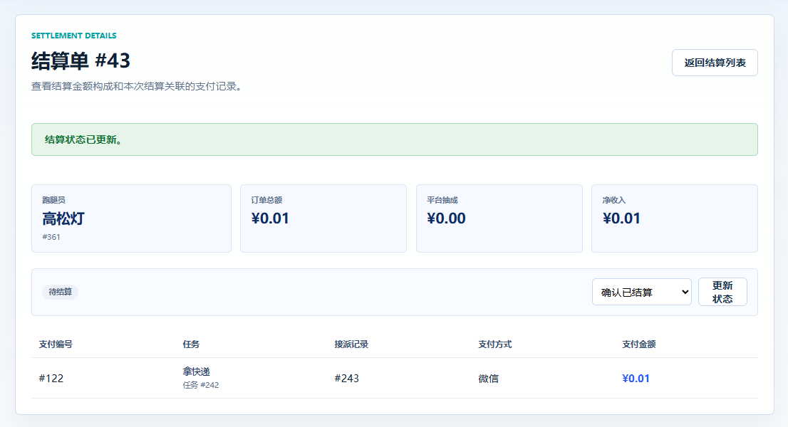
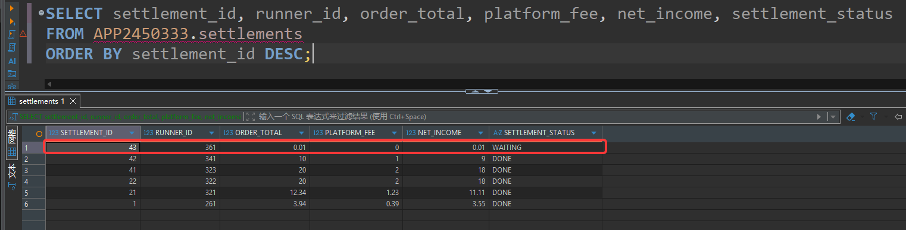

# 组员9：结算、审计与报表测试结果记录

本文档用于记录 TC-SETTLE-01 至 TC-SETTLE-10 的实际执行结果。执行测试时，建议同时保留页面截图和 SQL 查询截图。

## 测试环境

| 项目 | 内容 |
| --- | --- |
| 测试分支 | test |
| 后端启动方式 | 本地 `dotnet run` |
| 数据库连接方式 | SSH 隧道转发至 Oracle |
| 数据库地址 | `localhost:15210/orclpdb1` |
| 主要 Schema | `APP2450333` |
| 管理员账号 | admin |
| 跑腿员账号 | 待填写 |
| 测试日期 | 8.25 |

## 测试结果汇总

| 用例编号 | 测试点 | 结果 | 证据位置 | 备注 |
| --- | --- | --- | --- | --- |
| TC-SETTLE-01 | 生成结算单 | 待测 | 待填写 |  |
| TC-SETTLE-02 | 重复结算限制 | 待测 | 待填写 |  |
| TC-SETTLE-03 | 跑腿员归属校验 | 待测 | 待填写 |  |
| TC-SETTLE-04 | 退款/投诉中支付不结算 | 待测 | 待填写 | 可能依赖测试数据 |
| TC-SETTLE-05 | 结算状态机 | 待测 | 待填写 |  |
| TC-SETTLE-06 | 三类审计 | 待测 | 待填写 |  |
| TC-SETTLE-07 | 统计面板 | 待测 | 待填写 |  |
| TC-SETTLE-08 | 报表生成与导出 | 待测 | 待填写 |  |
| TC-SETTLE-09 | 删除报表不动审计 | 待确认 | 待填写 | 当前需确认是否有删除功能 |
| TC-SETTLE-10 | 跑腿员查看本人结算 | 待测 | 待填写 | 需要跑腿员账号 |

## TC-SETTLE-01：生成结算单

### 测试目标

验证管理员可以根据跑腿员可结算支付记录生成结算单。

### 实际操作

待填写：

1. 使用管理员账号登录。
2. 进入结算候选页面。
3. 选择一个存在可结算支付记录的跑腿员。
4. 点击生成结算单。
5. 进入结算详情页查看结算金额和明细。
6. 使用 SQL 查询新生成的结算单和明细。

### 页面现象





### SQL 证据

```sql
SELECT settlement_id, runner_id, order_total, platform_fee, net_income, settlement_status
FROM APP2450333.settlements
ORDER BY settlement_id DESC;
```

```sql
SELECT settlement_id, payment_id
FROM APP2450333.settlement_payment_items
WHERE settlement_id = :sid
ORDER BY payment_id;
```

### 实际结果

待填写。

### 结论

通过

## TC-SETTLE-02：重复结算限制

### 测试目标

验证同一笔支付记录不会被重复结算。

### 实际操作

待填写：

1. 
2. 
3. 

### 页面现象

待填写。

### SQL 证据

```sql
SELECT payment_id, COUNT(*) AS cnt
FROM APP2450333.settlement_payment_items
GROUP BY payment_id
HAVING COUNT(*) > 1;
```

### 实际结果

待填写。

### 结论

待填写：通过 / 失败 / 阻塞 / 需确认。

## TC-SETTLE-03：跑腿员归属校验

### 测试目标

验证结算数据不会跨跑腿员错误归属，跑腿员也不能查看他人结算详情。

### 实际操作

待填写：

1. 
2. 
3. 

### 页面现象

待填写。

### SQL 证据

```sql
SELECT settlement_id, runner_id, order_total, settlement_status
FROM APP2450333.settlements
WHERE runner_id = :runner_id
ORDER BY settlement_id DESC;
```

### 实际结果

待填写。

### 结论

待填写：通过 / 失败 / 阻塞 / 需确认。

## TC-SETTLE-04：退款/投诉中支付不结算

### 测试目标

验证存在退款或投诉争议的支付记录不会进入结算。

### 实际操作

待填写：

1. 
2. 
3. 

### 页面现象

待填写。

### SQL 证据

```sql
SELECT refund_id, payment_id, process_status
FROM APP2450333.refunds
WHERE process_status IN ('APPLY', 'APPROVED', 'DONE');
```

```sql
SELECT complaint_id, record_id, process_status
FROM APP2450333.complaints
WHERE process_status IN ('SUBMITTED', 'PROCESSING');
```

```sql
SELECT settlement_id, payment_id
FROM APP2450333.settlement_payment_items
WHERE payment_id = :payment_id;
```

### 实际结果

待填写。

### 结论

待填写：通过 / 失败 / 阻塞 / 需确认。

## TC-SETTLE-05：结算状态机

### 测试目标

验证结算状态只能按允许路径流转，`DONE` 为终态。

### 实际操作

待填写：

1. 
2. 
3. 

### 页面现象

待填写。

### SQL 证据

```sql
SELECT settlement_id, runner_id, settlement_status
FROM APP2450333.settlements
WHERE settlement_id = :sid;
```

### 实际结果

待填写。

### 结论

待填写：通过 / 失败 / 阻塞 / 需确认。

## TC-SETTLE-06：三类审计

### 测试目标

验证支付、退款、状态日志三类审计都能正确写入主表和对应关联表。

### 实际操作

待填写：

1. 
2. 
3. 

### 页面现象

待填写。

### SQL 证据

```sql
SELECT audit_id, audit_object, audit_result, audited_at, exception_note
FROM APP2450333.audit_logs
ORDER BY audit_id DESC
FETCH FIRST 20 ROWS ONLY;
```

```sql
SELECT audit_id, payment_id
FROM APP2450333.audit_payment_checks
ORDER BY audit_id DESC;
```

```sql
SELECT audit_id, refund_id
FROM APP2450333.audit_refund_checks
ORDER BY audit_id DESC;
```

```sql
SELECT audit_id, log_id
FROM APP2450333.audit_status_log_checks
ORDER BY audit_id DESC;
```

### 实际结果

待填写。

### 结论

待填写：通过 / 失败 / 阻塞 / 需确认。

## TC-SETTLE-07：统计面板

### 测试目标

验证统计面板展示值与数据库汇总结果一致。

### 实际操作

待填写：

1. 
2. 
3. 

### 页面现象

待填写。

### SQL 证据

```sql
SELECT COUNT(*) AS settlement_count,
       SUM(order_total) AS total_order_amount,
       SUM(platform_fee) AS total_platform_fee,
       SUM(net_income) AS total_net_income
FROM APP2450333.settlements;
```

### 实际结果

待填写。

### 结论

待填写：通过 / 失败 / 阻塞 / 需确认。

## TC-SETTLE-08：报表生成与导出

### 测试目标

验证订单、支付、投诉报表可以按月份生成并导出 CSV。

### 实际操作

待填写：

1. 
2. 
3. 

### 页面现象

待填写。

### SQL 证据

```sql
SELECT report_id, report_type, stat_period, generated_at, report_status
FROM APP2450333.reports
ORDER BY report_id DESC;
```

```sql
SELECT report_id, audit_id
FROM APP2450333.report_audit_items
WHERE report_id = :report_id
ORDER BY audit_id;
```

### 实际结果

待填写。

### 结论

待填写：通过 / 失败 / 阻塞 / 需确认。

## TC-SETTLE-09：删除报表不动审计

### 测试目标

验证删除报表时不删除原始审计日志。

### 当前执行情况

待填写。当前需先确认系统是否提供报表删除入口或删除接口。

### SQL 证据

```sql
SELECT report_id, report_type, stat_period, report_status
FROM APP2450333.reports
WHERE report_id = :report_id;
```

```sql
SELECT report_id, audit_id
FROM APP2450333.report_audit_items
WHERE report_id = :report_id;
```

```sql
SELECT audit_id, audit_object, audit_result, audited_at
FROM APP2450333.audit_logs
WHERE audit_id = :audit_id;
```

### 实际结果

待填写。

### 结论

建议先填写：阻塞 / 需确认。

## TC-SETTLE-10：跑腿员查看本人结算

### 测试目标

验证跑腿员只能查看本人结算列表和详情。

### 实际操作

待填写：

1. 
2. 
3. 

### 页面现象

待填写。

### SQL 证据

```sql
SELECT settlement_id, runner_id, order_total, platform_fee, net_income, settlement_status
FROM APP2450333.settlements
WHERE runner_id = :runner_id
ORDER BY settlement_id DESC;
```

```sql
SELECT settlement_id, payment_id
FROM APP2450333.settlement_payment_items
WHERE settlement_id = :sid
ORDER BY payment_id;
```

### 实际结果

待填写。

### 结论

待填写：通过 / 失败 / 阻塞 / 需确认。

