# 组员2：数据库与基础数据测试结果记录

## 1. 执行信息

| 项目 | 内容 |
| --- | --- |
| 执行人 | 组员2 |
| 执行日期 | 2026-09-09 |
| 测试范围 | TC-DB-01～TC-DB-06 |
| 测试分支 | `test` |
| 参考提交 | `45d986b` |
| 数据库工具 | DBeaver 26.2.0 |
| 数据库连接 | `127.0.0.1:15210/orclpdb1`（SSH 隧道） |
| 数据库 Schema | `APPUSER` |
| 测试方式 | TC-DB-01～05 使用只读 SQL；TC-DB-06 使用浏览器登录验证 |

本轮数据库检查只执行 `SELECT` 查询，没有执行 `INSERT`、`UPDATE`、`DELETE` 或 DDL。SQL 文件和截图均未记录数据库口令。

## 2. 结果汇总

| 用例编号 | 测试内容 | 实际结果 | 结论 |
| --- | --- | --- | --- |
| TC-DB-01 | 24 张业务表齐全 | `USER_TABLES` 统计为 24，表清单查询返回 24 行 | 通过 |
| TC-DB-02 | 003～006 迁移生效 | 账号状态约束、评价完整性约束、密码字段与哈希统计、两个唯一索引均正常 | 通过 |
| TC-DB-03 | 密码不明文存储 | 65 个用户的密码全部符合 Identity 哈希格式，异常数量为 0 | 通过 |
| TC-DB-04 | 基础数据完整 | 基础节点、3 类核心服务及服务节点适用规则均存在且状态正常 | 通过 |
| TC-DB-05 | 默认地址唯一 | 未查询到一个用户拥有多个默认地址的违规数据；唯一索引为 `UNIQUE / VALID` | 通过 |
| TC-DB-06 | 三种角色账号可登录 | 普通用户、跑腿员和管理员均能登录，并显示与角色相符的页面与导航 | 通过 |

## 3. 分项记录

### 3.1 TC-DB-01：24 张业务表齐全

执行 [`sql/TC-DB-01-业务表检查.sql`](sql/TC-DB-01-业务表检查.sql)，分别统计当前 Schema 的表数量并查询完整表名清单。

- 表数量查询结果为 `24`。
- 表清单查询返回 `24` 行，包含 `USERS`、`TASKS`、`PAYMENTS`、`REVIEWS`、`SETTLEMENTS` 等项目业务表。

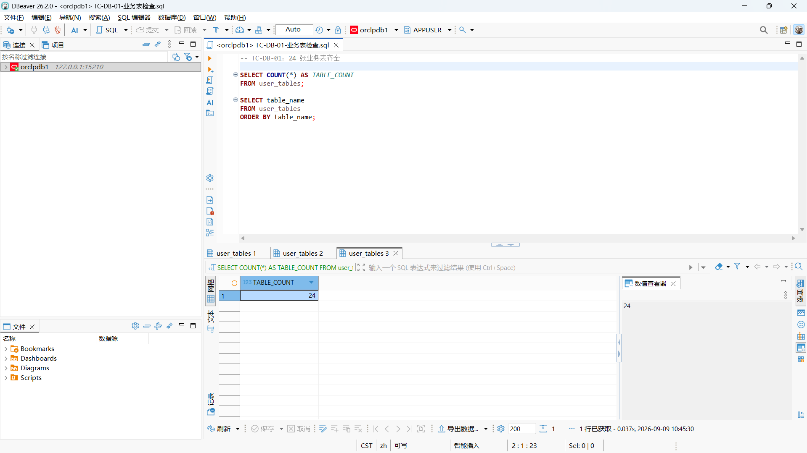

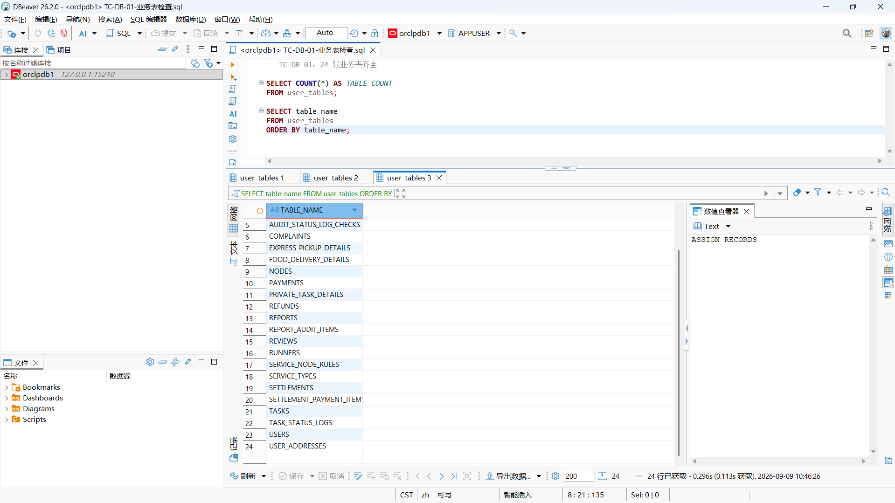

**结论：通过。**

### 3.2 TC-DB-02：003～006 迁移全部生效

执行 [`sql/TC-DB-02-003至006迁移核验.sql`](sql/TC-DB-02-003至006迁移核验.sql)，检查账号生命周期、评价完整性、密码迁移及业务唯一索引。

#### 003 账号生命周期

`CK_USERS_STATUS` 为 `ENABLED / VALIDATED`，约束条件限定账号状态只能为 `NORMAL`、`BLOCKED` 或 `CANCELLED`。

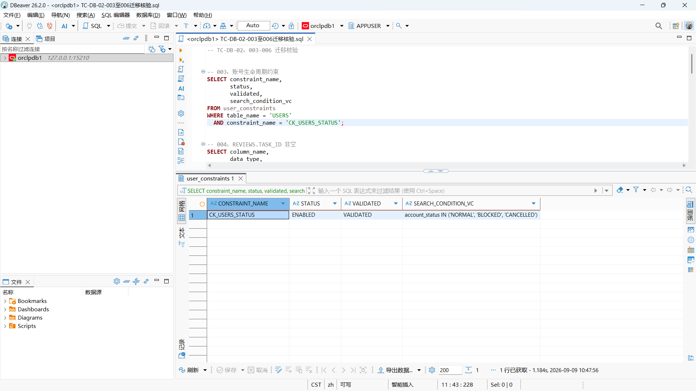

#### 004 评价完整性

截图显示以下三个约束均为 `ENABLED / VALIDATED`：

- `FK_REVIEWS_RECORD_TASK`
- `UK_ASSIGN_RECORD_TASK`
- `UK_REVIEWS_TASK`

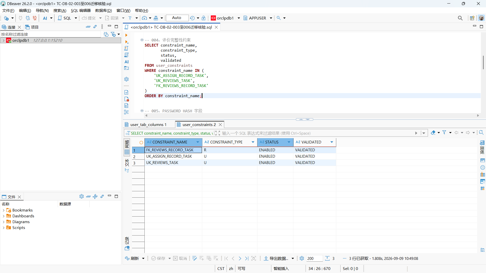

`REVIEWS.TASK_ID` 的字段查询结果为 `NUMBER / NULLABLE=N`，证明迁移后的任务关联字段存在且不可为空。

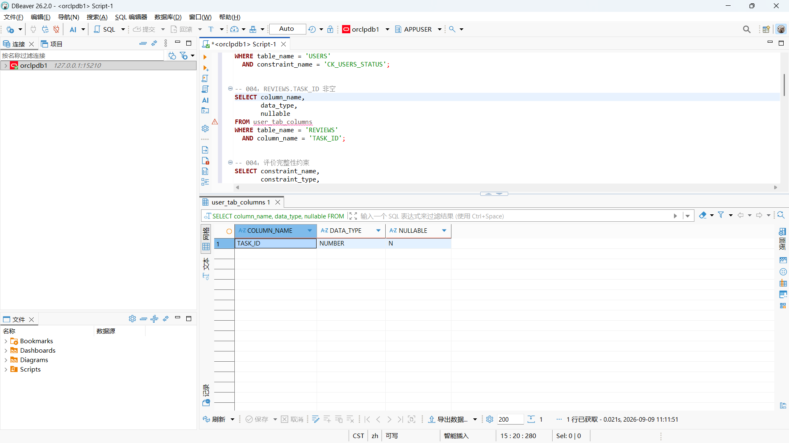

#### 005 密码迁移

`USERS.PASSWORD_HASH` 的字段查询结果为 `VARCHAR2(256 CHAR) / NULLABLE=N`。

哈希统计结果为：`USER_COUNT=65`、`HASH_OK_COUNT=65`、`INVALID_COUNT=0`，说明现有用户密码均符合项目采用的 Identity 哈希格式。

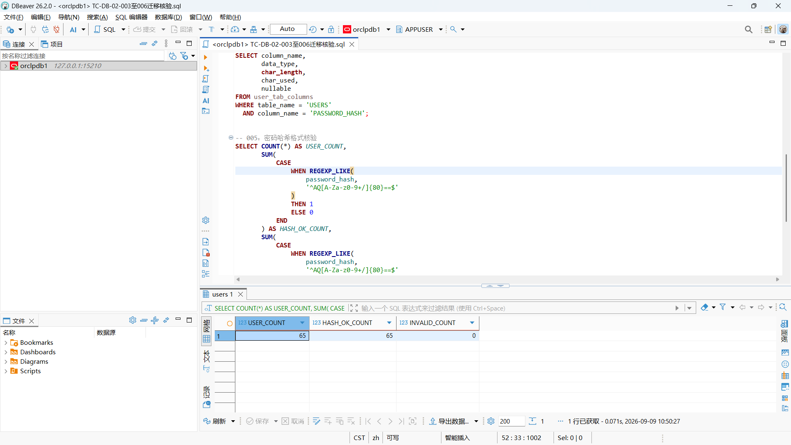

#### 006 业务完整性索引

`UK_SERVICE_TYPES_NAME_CI` 和 `UK_USER_ADDRESSES_ONE_DEFAULT` 均为 `UNIQUE / VALID`。

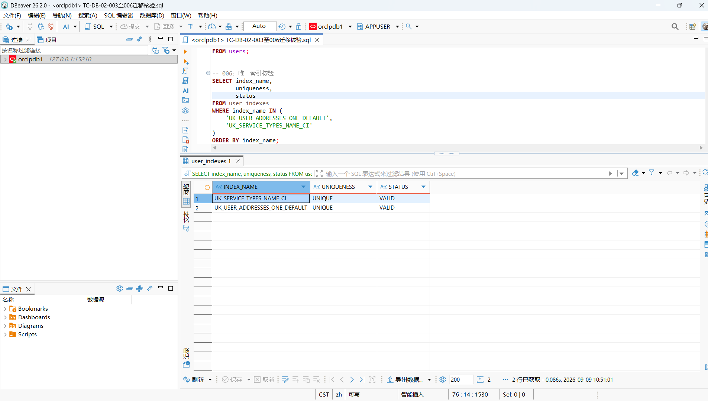

**结论：通过。003～006 迁移涉及的关键字段、约束和索引均已生效。**

### 3.3 TC-DB-03：密码不明文存储

执行 [`sql/TC-DB-03-密码哈希检查.sql`](sql/TC-DB-03-密码哈希检查.sql)，只统计符合哈希格式和不符合格式的记录数量，不导出任何用户的实际密码哈希。

查询结果：

- 用户总数：65
- 符合哈希格式：65
- 异常记录：0

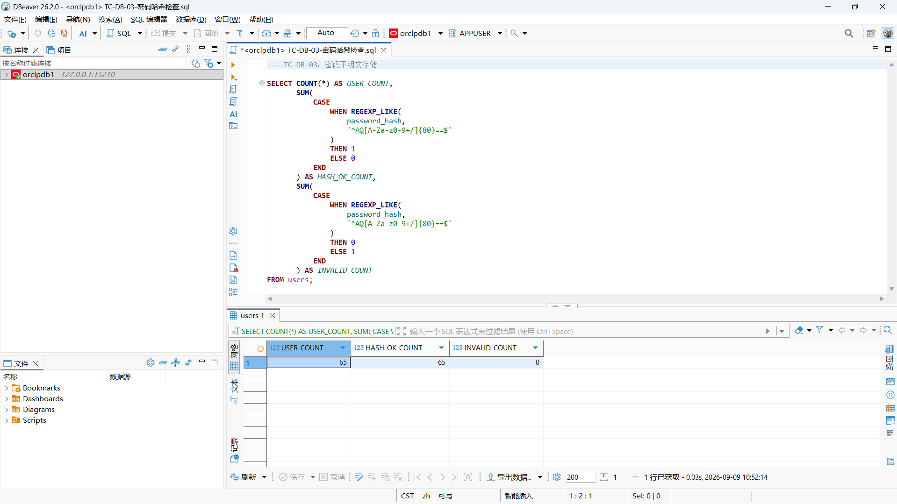

**结论：通过。数据库中没有发现明文或格式异常的密码记录。**

### 3.4 TC-DB-04：基础数据完整

执行 [`sql/TC-DB-04-基础数据检查.sql`](sql/TC-DB-04-基础数据检查.sql)，检查节点、服务类型和服务节点适用规则。

- 节点数据包含嘉定校区南门、菜鸟驿站和外卖分发点等基础节点，状态为 `NORMAL`。
- 服务类型包含外卖分发、快递代取和私人跑腿，状态为 `ENABLED`。
- 规则查询可以看到外卖分发—外卖分发点、快递代取—菜鸟驿站以及私人跑腿对应节点的绑定关系。

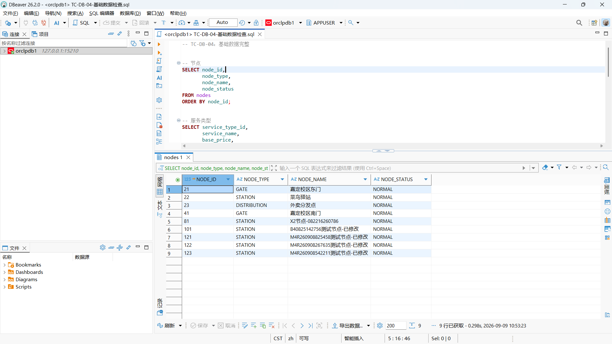

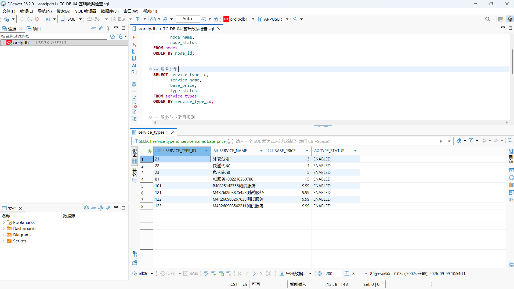

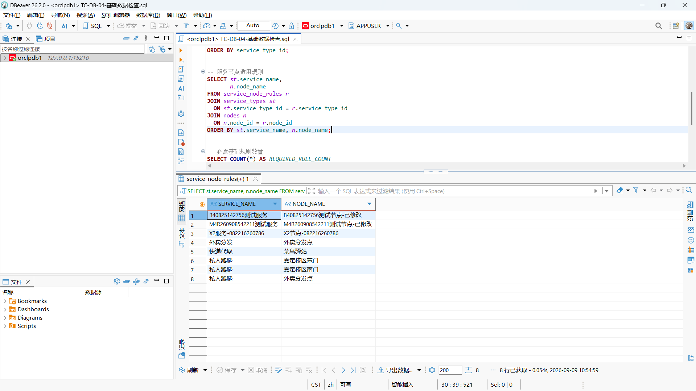

必需基础规则统计结果为 `REQUIRED_RULE_COUNT=4`。

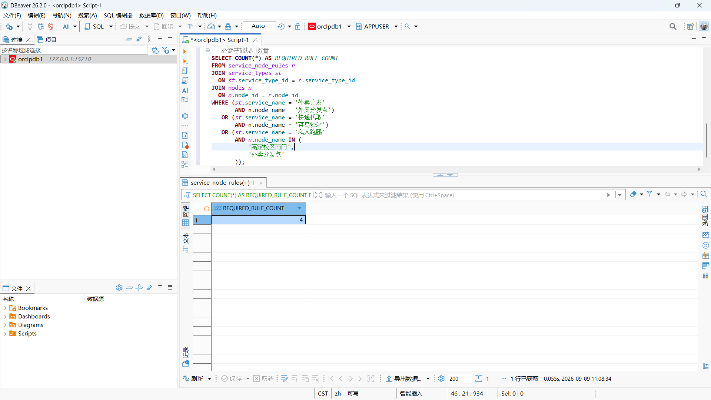

**结论：通过。**

### 3.5 TC-DB-05：默认地址唯一

执行 [`sql/TC-DB-05-默认地址唯一检查.sql`](sql/TC-DB-05-默认地址唯一检查.sql)，同时检查现有数据和数据库唯一索引。

- 多默认地址违规查询返回 0 行。
- `UK_USER_ADDRESSES_ONE_DEFAULT` 为 `UNIQUE / VALID`。

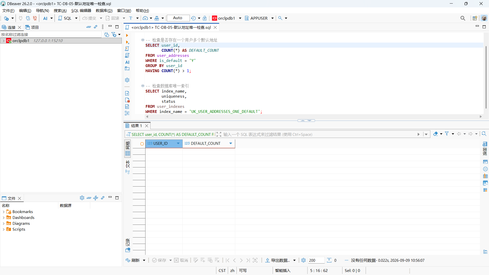

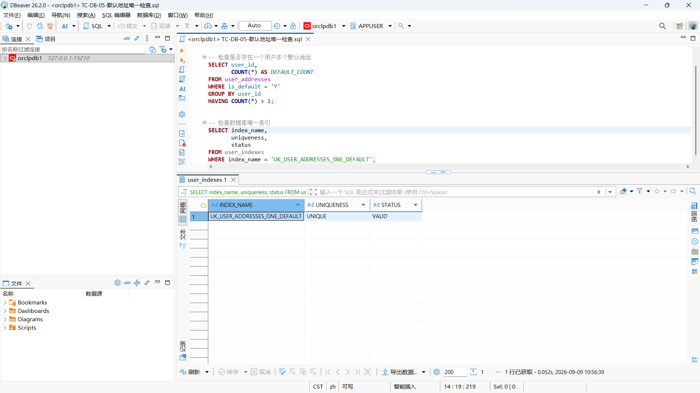

**结论：通过。现有数据不存在一名用户拥有多个默认地址的情况，数据库约束也处于有效状态。**

### 3.6 TC-DB-06：普通用户、跑腿员和管理员均可登录

分别使用普通用户、跑腿员和管理员测试账号登录系统，并进入能够体现账号身份和权限菜单的页面。

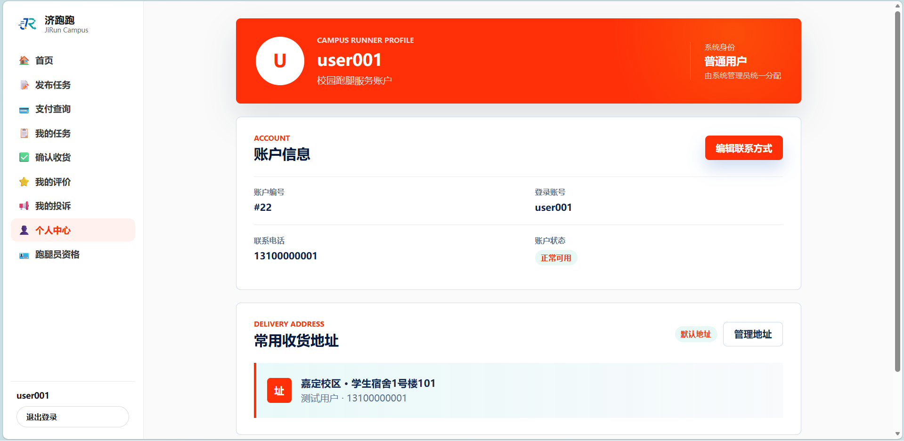

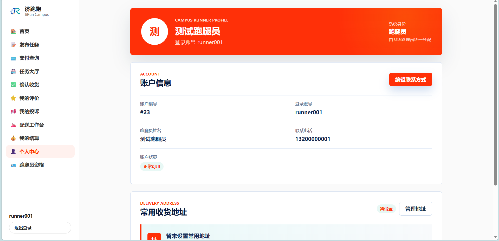

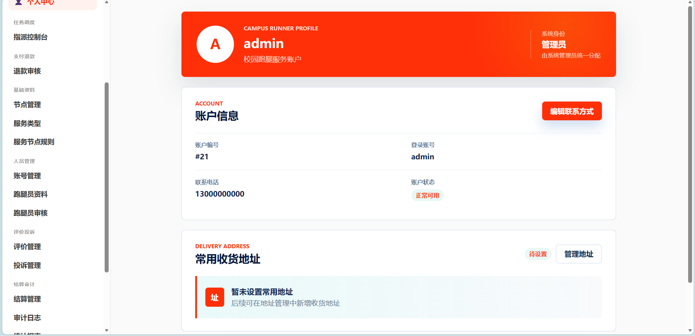

页面分别显示“普通用户”“跑腿员”和“管理员”身份，左侧导航也与对应角色一致。

**结论：通过。**

## 4. 证据完整性说明

当前已保存：

- 5 份实际执行的 SQL 文件；
- 15 张 DBeaver 查询截图；
- 3 张角色登录截图。

CSV 导出属于附加的结构化证据，不是 `docs/test-plan.md` 的强制要求，当前未保存 CSV 不影响测试结论。

## 5. 总体结论

TC-DB-01～TC-DB-06 共 6 项测试全部通过。数据库业务表、迁移对象、密码哈希、基础数据、默认地址唯一性及三类测试账号均工作正常；SQL、数据库结果截图和角色登录截图已经覆盖测试计划要求。
