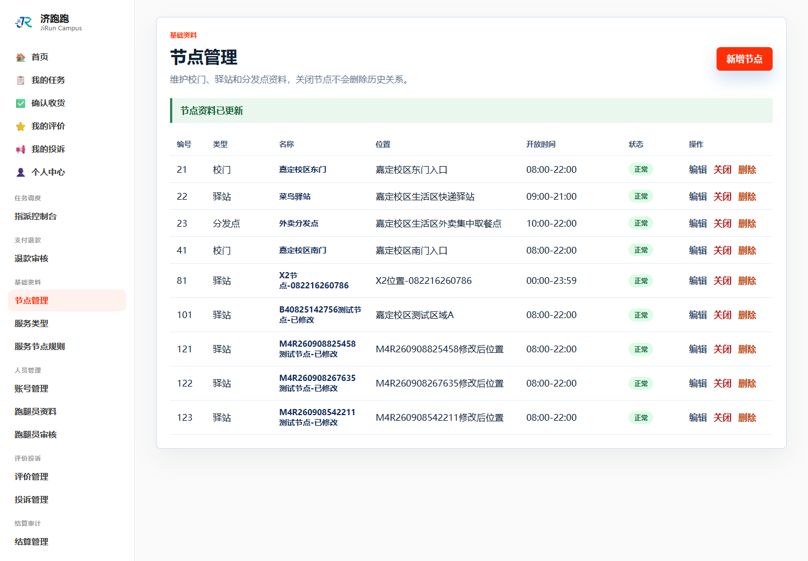

# TC-BASE-01：节点新增、修改、关闭与恢复

## 1. test-plan 原始要求

| 项目 | 内容 |
| --- | --- |
| 前置条件 | 管理员登录 |
| 测试步骤 | `/Node` 新增节点 → 修改 → 关闭 → 恢复 |
| 预期结果 | 各操作生效；关闭后发布任务时不可选 |
| 证据要求 | 截图 + SQL |

## 2. 实际操作

1. 管理员新增本轮隔离节点。
2. 修改节点名称和位置。
3. 关闭节点，以普通用户进入 `/Task/Create` 检查节点下拉框。
4. 管理员恢复节点。

## 3. 页面证据





## 4. SQL 核验

```sql
SELECT node_id, node_type, node_name, location, open_time, node_status
FROM nodes
WHERE node_id = 123;
```

## 5. SQL 实际结果

查询返回 1 行：节点编号 123，名称为 `M4R260908542211测试节点-已修改`，最终状态为 `NORMAL`。关闭状态已被后续“恢复”操作覆盖，因此关闭过程以页面截图为准。

## 6. 结论

通过。新增、修改、关闭和恢复均生效，关闭期间发布任务页不可选择该节点。

