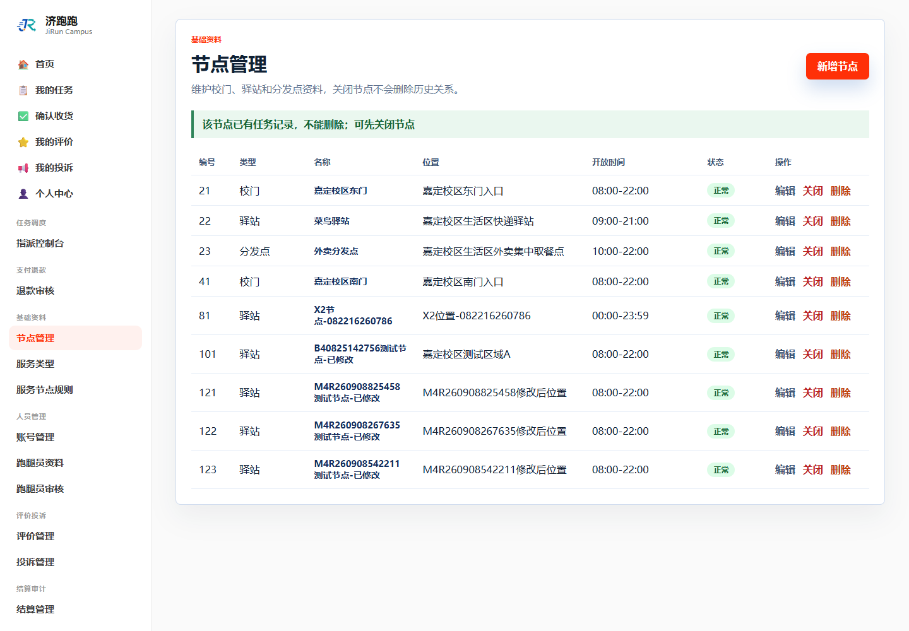

# TC-BASE-02：使用中节点删除保护

## 1. test-plan 原始要求

| 项目 | 内容 |
| --- | --- |
| 前置条件 | 节点被历史任务引用 |
| 测试步骤 | 尝试删除被引用的节点 |
| 预期结果 | 拒绝删除；历史数据不受影响 |
| 证据要求 | 截图 |

## 2. 实际操作

使用 TC-BASE-04 发布的任务 341 引用节点 123，然后管理员在 `/Node` 尝试删除该节点。

## 3. 页面证据



## 4. 补充 SQL 核验

```sql
SELECT n.node_id, n.node_name, n.node_status,
       t.task_id, t.task_title, t.task_status
FROM nodes n
JOIN tasks t ON t.node_id = n.node_id
WHERE n.node_id = 123
  AND t.task_id = 341;
```

## 5. SQL 实际结果

查询返回节点 123 和任务 341 的关联记录；节点仍存在且状态为 `NORMAL`，任务仍存在且状态为 `WAITING`。

## 6. 结论

通过。删除请求被拒绝，节点和引用它的任务均未被破坏。

