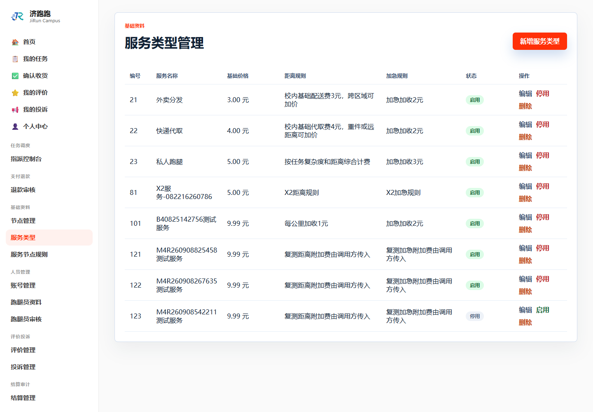
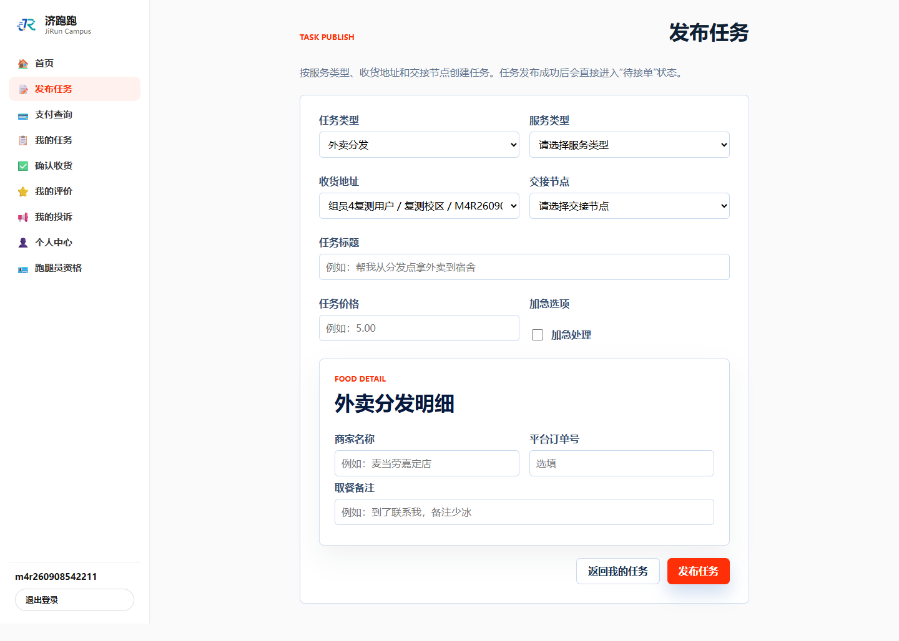

# TC-BASE-03：服务类型维护

## 1. test-plan 原始要求

| 项目 | 内容 |
| --- | --- |
| 前置条件 | 管理员登录 |
| 测试步骤 | `/ServiceType` 新增服务类型（含价格规则）→ 停用 |
| 预期结果 | 新增成功；停用后发布任务时不可选 |
| 证据要求 | 截图 + SQL |

## 2. 实际操作

1. 新增基础价 9.99 元、包含距离和加急规则的隔离服务类型。
2. 停用该类型，以普通用户检查发布任务页。
3. 为 TC-BASE-04 恢复启用。

## 3. 页面证据






## 4. SQL 核验

```sql
SELECT service_type_id, service_name, base_price,
       distance_rule, urgent_rule, type_status
FROM service_types
WHERE service_type_id = 123;
```

## 5. SQL 实际结果

查询返回 1 行：服务类型编号 123，基础价 `9.99`，距离规则和加急规则均已保存，最终状态为 `ENABLED`。停用状态已被后续恢复启用覆盖，以停用时页面截图和发布页不可选截图为准。

## 6. 结论

通过。服务类型新增和停用成功，停用期间不能用于发布任务。

