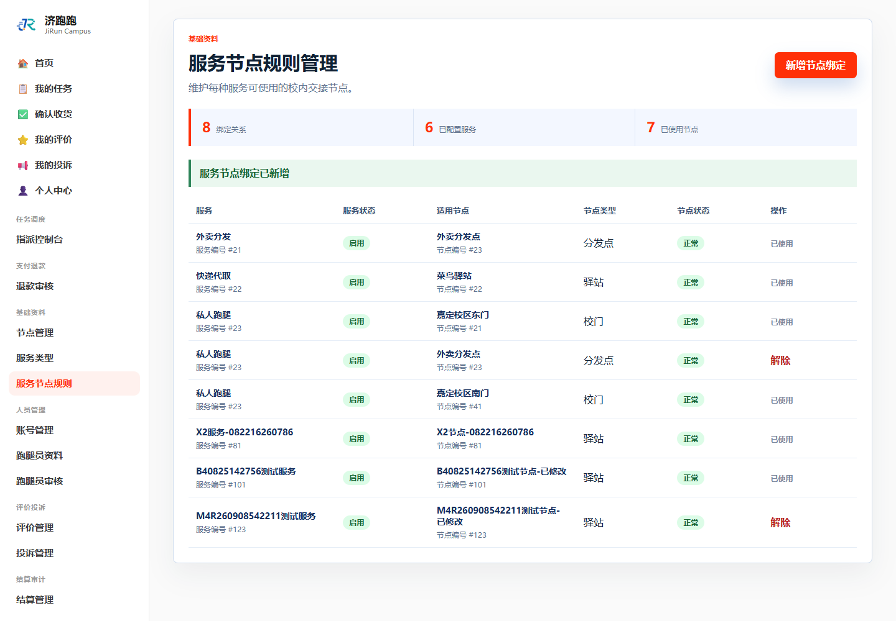
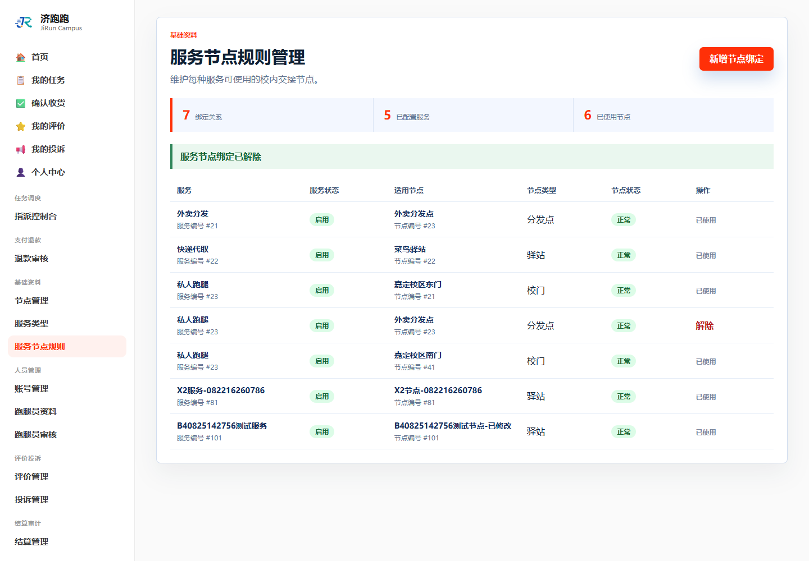
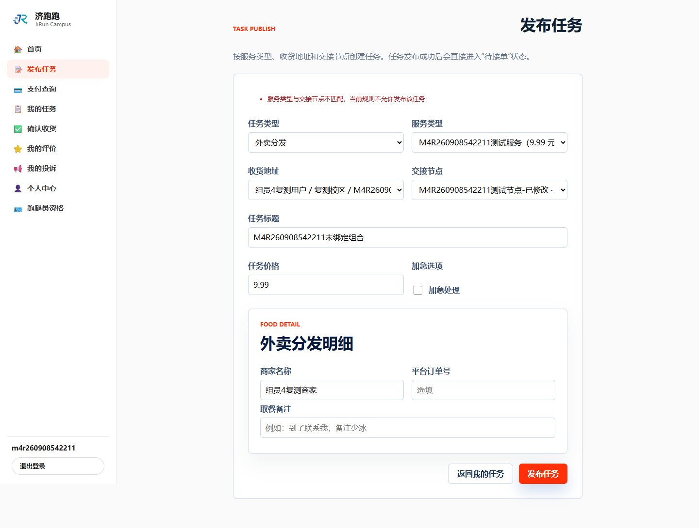
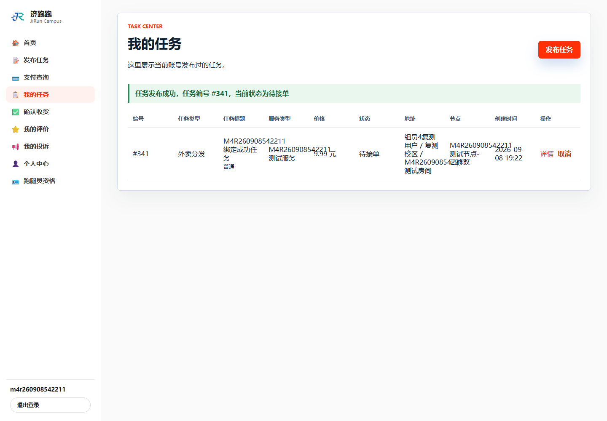

# TC-BASE-04：服务节点适用规则

## 1. test-plan 原始要求

| 项目 | 内容 |
| --- | --- |
| 前置条件 | 已有服务类型和节点 |
| 测试步骤 | `/ServiceNodeRule` 绑定、解绑服务类型与节点 |
| 预期结果 | 绑定后可发布；解绑后发布时校验拒绝 |
| 证据要求 | 截图 + SQL |

## 2. 实际操作

1. 绑定服务类型 123 与节点 123。
2. 解除绑定，使用该组合尝试发布任务。
3. 确认发布被拒绝后恢复绑定。
4. 使用相同组合再次发布任务。

## 3. 页面证据









## 4. SQL 核验

验证最终绑定关系：

```sql
SELECT snr.service_type_id, st.service_name,
       snr.node_id, n.node_name
FROM service_node_rules snr
JOIN service_types st ON st.service_type_id = snr.service_type_id
JOIN nodes n ON n.node_id = snr.node_id
WHERE snr.service_type_id = 123
  AND snr.node_id = 123;
```

验证失败发布没有落库、成功发布正常落库：

```sql
SELECT task_id, task_title, service_type_id, node_id,
       task_price, task_status
FROM tasks
WHERE task_title LIKE 'M4R260908542211%'
ORDER BY task_id;
```

## 5. SQL 实际结果

- 绑定查询返回服务类型 123 与节点 123 的一条关联记录。
- 任务查询只返回 `M4R260908542211绑定成功任务`，任务编号 341、价格 9.99、状态 `WAITING`。
- 标题为“未绑定组合”的失败尝试没有记录，证明拒绝发生后没有写入任务主表。

## 6. 结论

通过。解绑组合被拒绝且未落库，恢复绑定后任务成功发布并落库。

