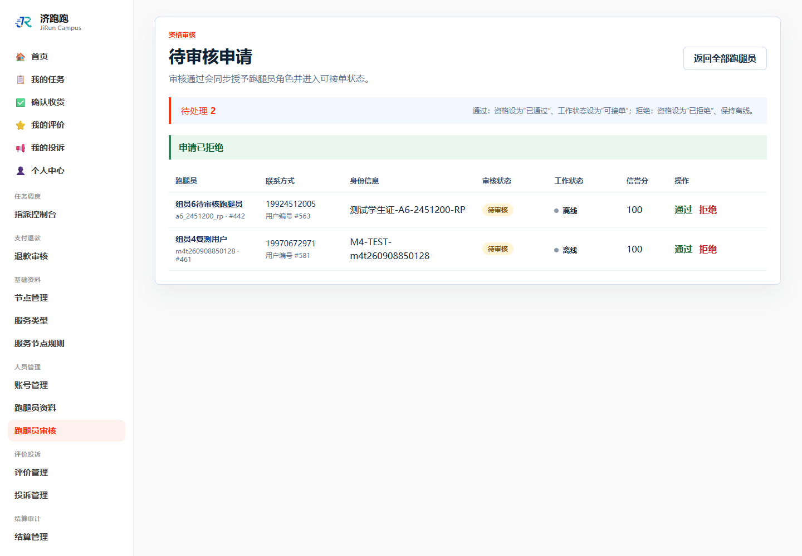
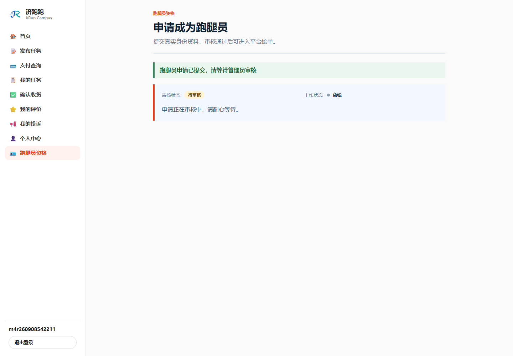
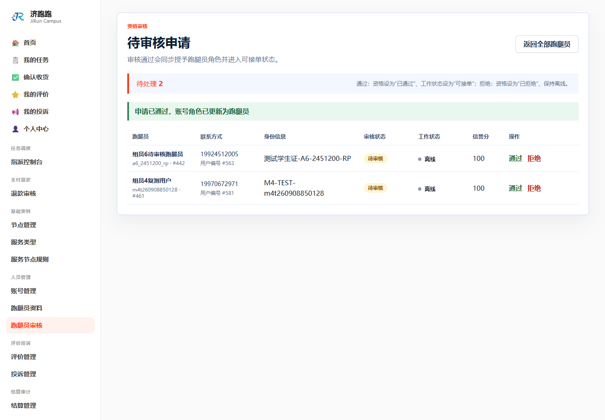

# TC-BASE-07：驳回后重新申请

## 1. test-plan 原始要求

| 项目 | 内容 |
| --- | --- |
| 前置条件 | 存在被驳回申请 |
| 测试步骤 | 管理员驳回 → 用户重新提交 → 再审通过 |
| 预期结果 | 状态依次为 `REJECTED`、`PENDING`、`APPROVED` |
| 证据要求 | 截图 + SQL |

## 2. 实际操作

1. 管理员驳回首次申请。
2. 用户重新进入申请页并提交新资料。
3. 管理员再次审核通过。

## 3. 页面证据







## 4. SQL 核验

```sql
SELECT u.username, u.user_role,
       r.runner_id, r.audit_status, r.work_status,
       r.real_name, r.identity_info
FROM users u
JOIN runners r ON r.user_id = u.user_id
WHERE u.username = 'm4r260908542211';
```

## 5. SQL 实际结果

查询显示最终审核状态为 `APPROVED`、角色为 `RUNNER`、工作状态为 `FREE`，且重申时填写的资料已经保存。本表没有审核状态历史表，因此单次最终查询不能独立证明此前的 `REJECTED/PENDING`；两个中间状态由各步骤完成后立即保存的页面截图证明。

## 6. 结论

通过。驳回后允许重新申请，并能再次审核通过。

