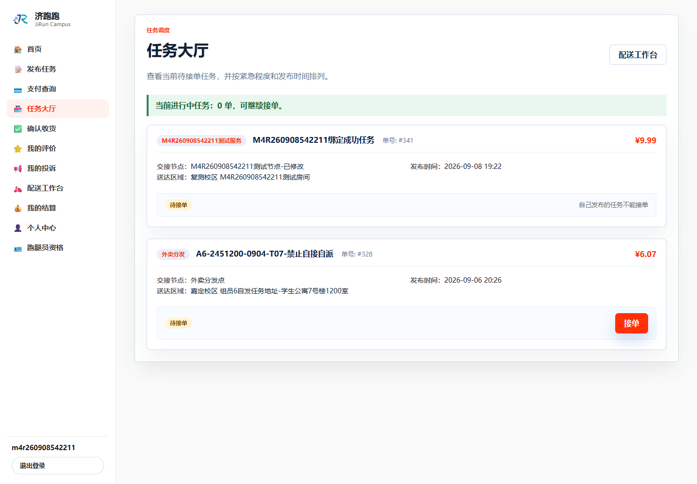

# TC-BASE-08：准备可接单账号

## 1. test-plan 原始要求

| 项目 | 内容 |
| --- | --- |
| 前置条件 | 跑腿员审核已通过 |
| 测试步骤 | 确认跑腿员为 `APPROVED` 且 `FREE` |
| 预期结果 | 该账号可以进入任务大厅抢单 |
| 证据要求 | 截图 + SQL |

## 2. 实际操作

使用审核通过的隔离账号重新建立浏览器会话并访问 `/Task/Hall`。

## 3. 页面证据



## 4. SQL 核验

```sql
SELECT u.user_id, u.username, u.user_role, u.account_status,
       r.runner_id, r.audit_status, r.work_status, r.credit_score
FROM users u
JOIN runners r ON r.user_id = u.user_id
WHERE u.username = 'm4r260908542211'
  AND u.user_role = 'RUNNER'
  AND u.account_status = 'NORMAL'
  AND r.audit_status = 'APPROVED'
  AND r.work_status = 'FREE';
```

## 5. SQL 实际结果

查询返回 1 行：用户 585、跑腿员 462，角色 `RUNNER`、账号状态 `NORMAL`、审核状态 `APPROVED`、工作状态 `FREE`。页面请求成功进入任务大厅，没有跳转到拒绝访问页。

## 6. 结论

通过。该账号满足可接单身份条件，可以作为后续接单测试账号。

