# 组员 6 接单派单与状态流转测试结果记录

## 1. 执行信息

| 项目 | 内容 |
| --- | --- |
| 执行人 | 桑治 |
| 执行日期 | 2026-09-06 |
| 测试范围 | TC-ASSIGN-01～TC-ASSIGN-09 |
| 参考分支 | test |
| 本地参考提交 | 5111500 |
| 测试地址 | https://47.116.60.57/ |
| 数据库 | 共享 Oracle 19c |
| 浏览器 | Google Chrome |
| 测试标识 | A6-2451200-0904 |

本次测试使用专用账号和任务。T01～T08 对应任务编号为 321、322、323、324、325、326、328、327；R1、R2、R3 对应跑腿员编号为 441、443、444，未审核账号 RP 对应跑腿员编号为 442。

## 2. 结果汇总

| 用例编号 | 测试内容 | 实际结果 | 结果 |
| --- | --- | --- | --- |
| TC-ASSIGN-01 | 任务大厅只显示待接单 | #321 指派后从大厅消失，#322 等待接单任务正常显示 | 通过 |
| TC-ASSIGN-02 | 跑腿员抢单 | R1 成功抢到 #322，生成 SELF 接派记录和状态日志 | 通过 |
| TC-ASSIGN-03 | 多单接单与资格限制 | R1 在 BUSY 状态继续承接 #323；RP 访问任务大厅被拒 | 通过 |
| TC-ASSIGN-04 | 并发抢单只成功一人 | R1、R2同时抢 #324，仅 R1 成功；数据库只有一条接派记录 | 通过 |
| TC-ASSIGN-05 | 管理员派单 | 管理员将 #325 指派给 R2，生成 ADMIN 接派记录 | 通过 |
| TC-ASSIGN-06 | 管理员重派与状态联动 | #321、#326 最终重派给 R2；R3 无活动任务后恢复 FREE | 通过 |
| TC-ASSIGN-07 | 禁止接自己的任务 | R1 无法自接 #328；管理员自派请求被服务端拒绝，未生成接派记录 | 通过 |
| TC-ASSIGN-08 | 配送状态顺序流转 | #322 依次进入 PICKED_UP、DELIVERING、WAIT_CONFIRM，日志完整 | 通过 |
| TC-ASSIGN-09 | 非法状态跳转被拒 | 对 #327 提交 ASSIGNED→WAIT_CONFIRM 请求后系统拒绝，状态和日志数不变 | 通过 |

结论：9 条用例全部执行并通过。

## 3. 分项记录

### 3.1 TC-ASSIGN-01：任务大厅只显示待接单

管理员将 T01（#321）指派给 R3 后，R1 打开任务大厅。大厅中显示 T02（#322）等 WAITING 任务，不再显示 #321。

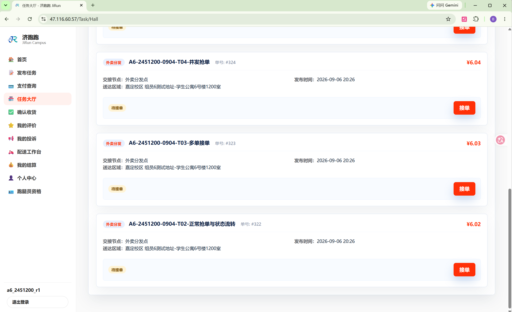

数据库核验：#321 状态为 ASSIGNED，#322 在抢单前为 WAITING。

**结果：通过。**

### 3.2 TC-ASSIGN-02：跑腿员正常抢单

R1 在任务大厅承接 T02（#322）。配送工作台显示该任务为已接单，并提供合法的下一步操作。

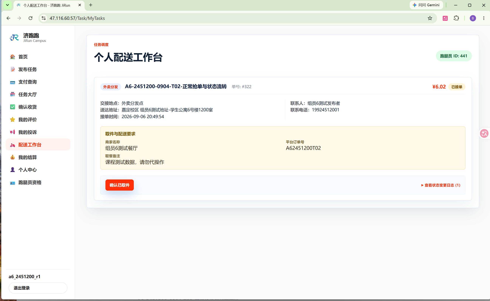

数据库核验：#322 生成接派记录 302，runner_id 为 441，operation_type 为 SELF；状态日志记录 WAITING→ASSIGNED。

**结果：通过。**

### 3.3 TC-ASSIGN-03：多单接单与资格限制

R1 已承接 #322 后继续承接 T03（#323），配送工作台同时显示两条活动任务，说明 BUSY 状态可以继续接单。

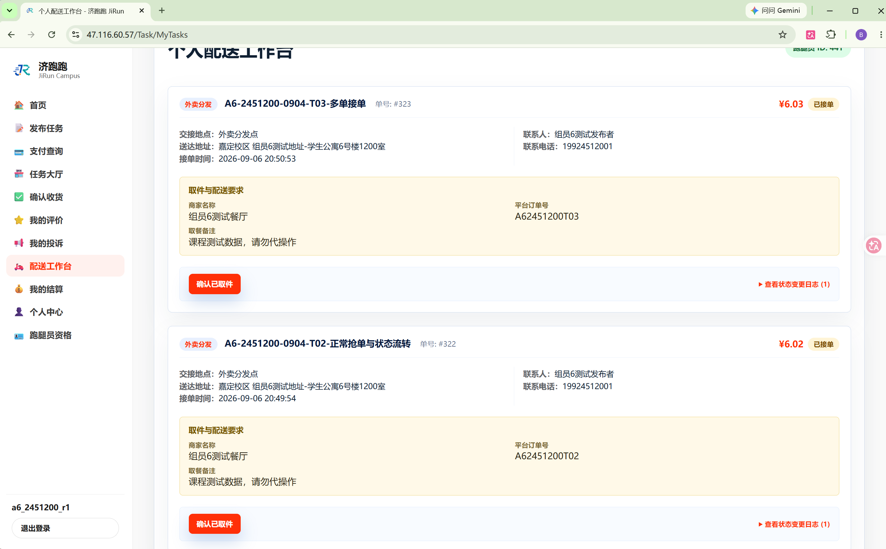

RP 的跑腿员申请保持 PENDING，登录后访问任务大厅被权限系统拦截。

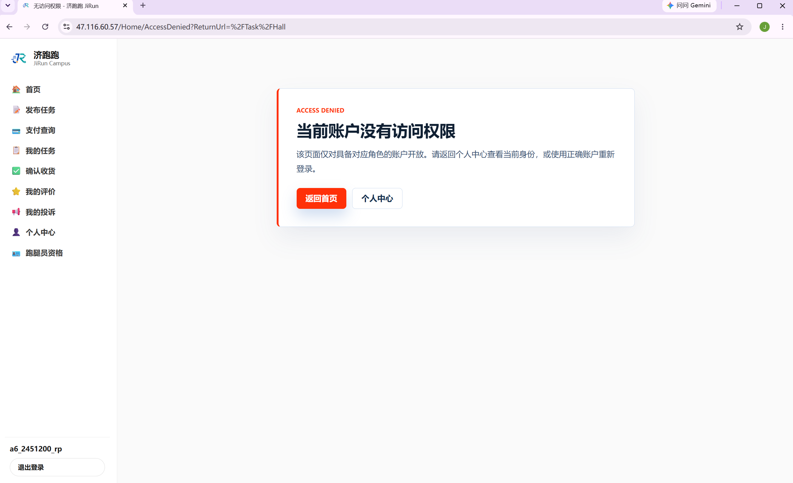

数据库核验：#322、#323 的最新承接人均为 R1；RP 为 PENDING / OFFLINE，活动任务数为 0。

**结果：通过。**

### 3.4 TC-ASSIGN-04：并发抢单只成功一人

R1 与 R2 使用独立登录会话同时承接 T04（#324）。R1 接单成功，R2 收到接单失败提示。

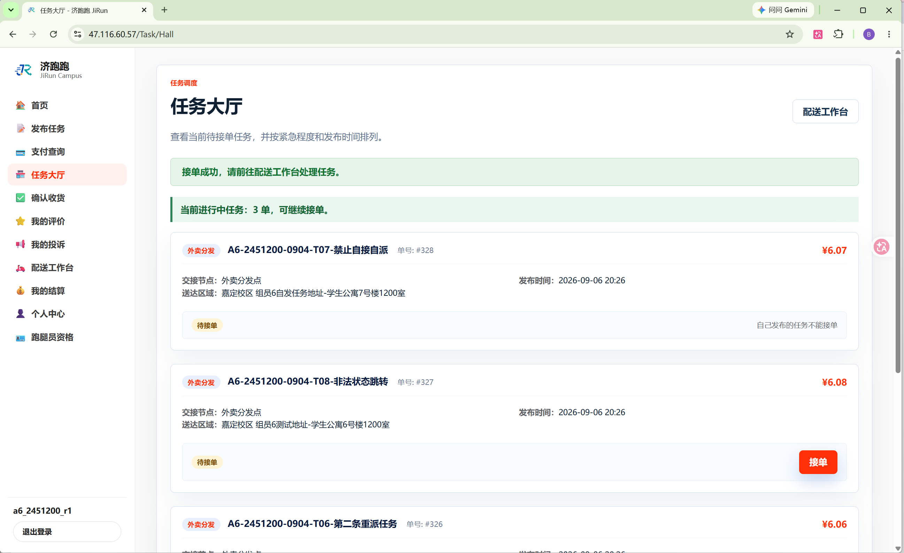

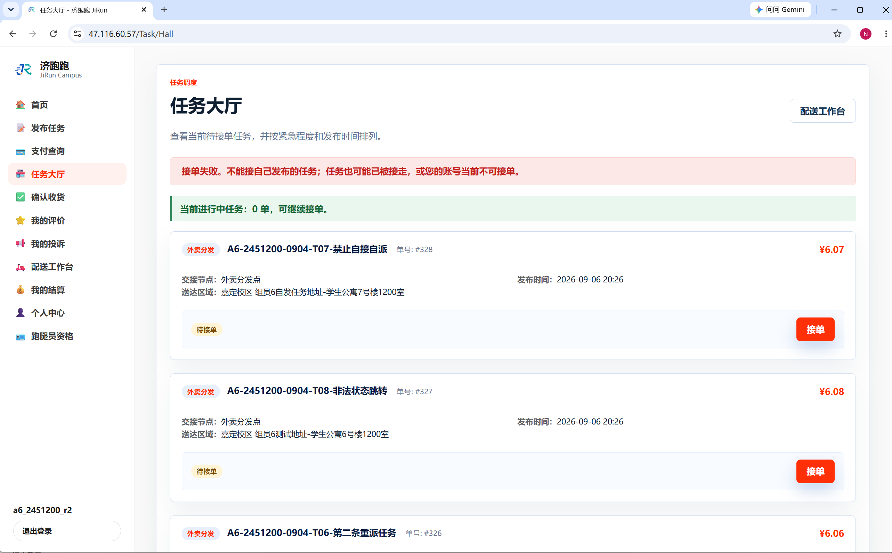

数据库核验：#324 状态为 ASSIGNED，接派记录数为 1，WAITING→ASSIGNED 日志数为 1。

**结果：通过。**

### 3.5 TC-ASSIGN-05：管理员派单

管理员在指派控制台将 T05（#325）派给 R2，页面显示任务指派成功。

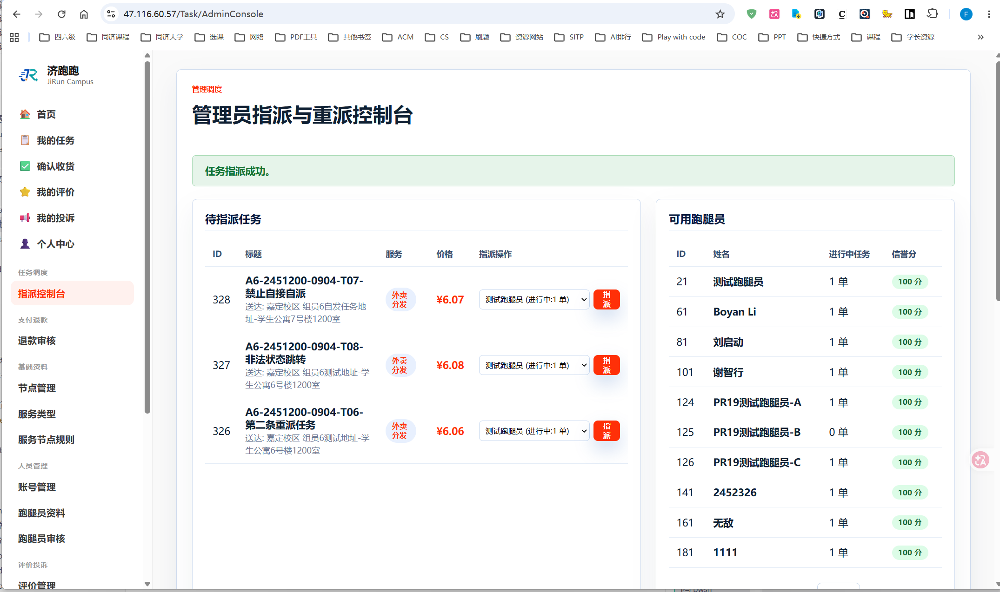

数据库核验：#325 生成接派记录 305，runner_id 为 443，operation_type 为 ADMIN；状态日志记录 WAITING→ASSIGNED。

**结果：通过。**

### 3.6 TC-ASSIGN-06：管理员重派与工作状态联动

R3 先承接 #321 和 #326，随后两项任务转交给 R2。操作过程中 #321 曾误选跑腿员 21，随后重新指派到目标跑腿员 R2；系统按设计保留了完整重派历史。最终页面显示任务重派成功。

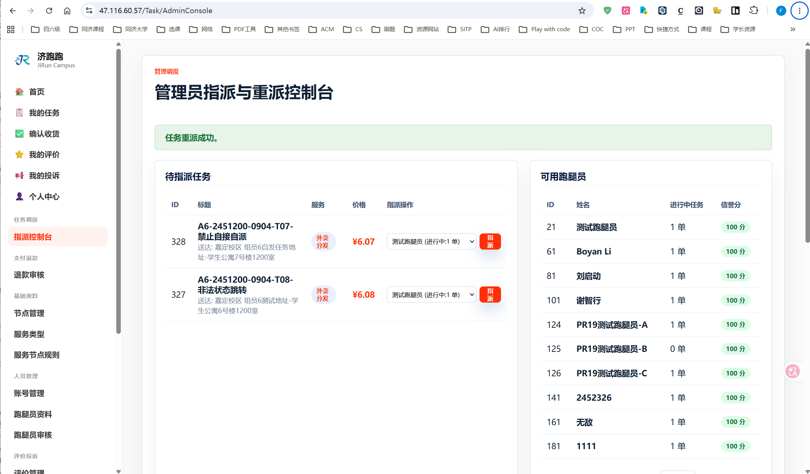

数据库核验：

- #321 保留 ADMIN 记录和两条 REASSIGN 记录，最终承接人为 R2；
- #326 保留 ADMIN 记录并新增一条 REASSIGN 记录，最终承接人为 R2；
- R2 最终为 BUSY，活动任务数为 3；
- R3 最终为 FREE，活动任务数为 0。

**结果：通过。**

### 3.7 TC-ASSIGN-07：禁止接自己的任务

T07（#328）由 R1 发布。R1 打开任务大厅时，任务卡片显示“自己发布的任务不能接单”，页面不提供接单按钮。

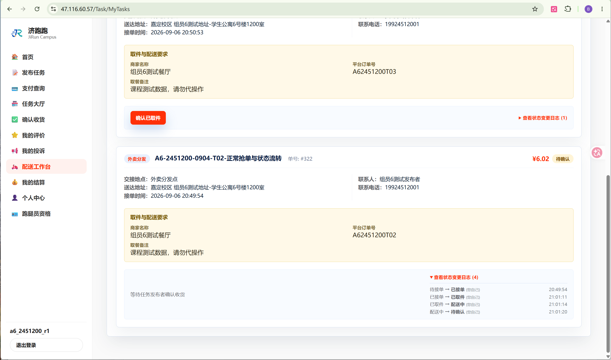

随后以管理员身份提交把 #328 指派给其发布者 R1 的请求，系统显示任务指派失败，并明确提示发布者不能承接自己的任务。

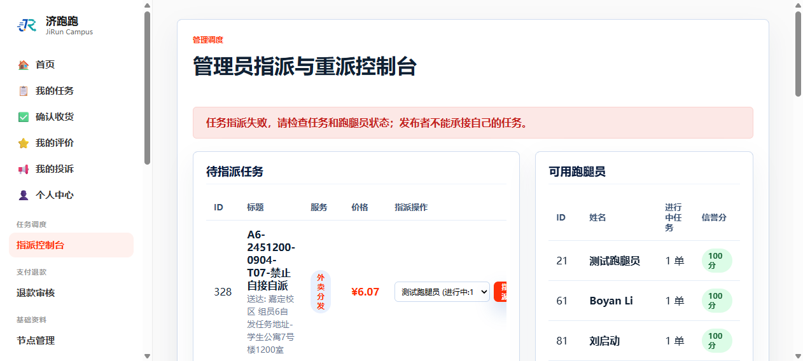

数据库核验：#328 保持 WAITING，接派记录数为 0，状态日志数为 0。

**结果：通过。**

### 3.8 TC-ASSIGN-08：配送状态顺序流转

R1 对 T02（#322）依次执行确认已取件、开始配送和确认已送达。任务最终进入待确认状态，页面日志展示完整流转过程。

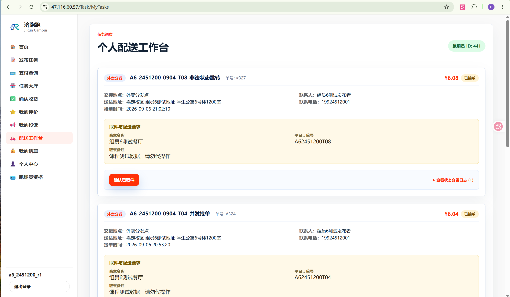

数据库核验：#322 的日志依次为：

1. WAITING→ASSIGNED；
2. ASSIGNED→PICKED_UP；
3. PICKED_UP→DELIVERING；
4. DELIVERING→WAIT_CONFIRM。

**结果：通过。**

### 3.9 TC-ASSIGN-09：非法状态跳转被拒

T08（#327）由管理员派给 R1，初始状态为 ASSIGNED。测试提交 ASSIGNED→WAIT_CONFIRM 的非法跳转请求后，页面显示“状态更新失败，请刷新页面后重试”，任务仍显示为已接单。

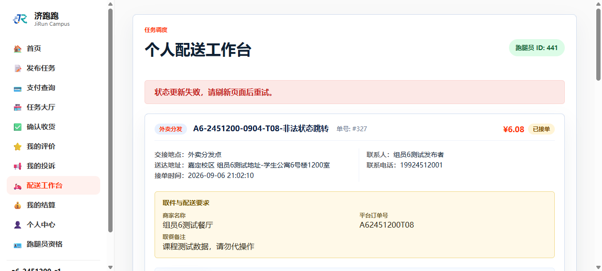

数据库复核：#327 仍为 ASSIGNED，接派记录数为 1，日志数为 1；没有新增非法状态日志。

**结果：通过。**

## 4. 数据库证据

本次数据库核验材料：

- [TC-ASSIGN-数据库核验.sql](sql/TC-ASSIGN-数据库核验.sql)
- [TC-ASSIGN-数据库核验结果.txt](sql/TC-ASSIGN-数据库核验结果.txt)

核验范围包括八个任务的最终状态、抢单/派单/重派记录、状态日志、跑腿员工作状态，以及并发抢单、自派拦截和非法状态跳转三个负向场景。

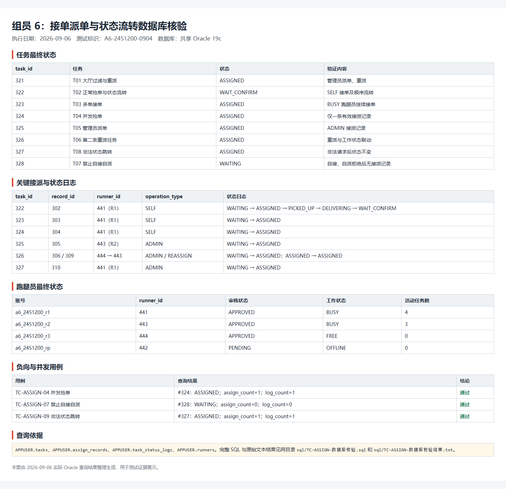

## 5. 测试结论

`TC-ASSIGN-01` 至 `TC-ASSIGN-09` 均已完成页面操作和数据库复核。任务大厅过滤、多单接单、并发抢单、管理员派单与重派、自接自派限制、配送状态机和非法跳转拦截符合当前测试计划。本轮未发现需要登记到 `docs/bug-list.md` 的功能缺陷。
