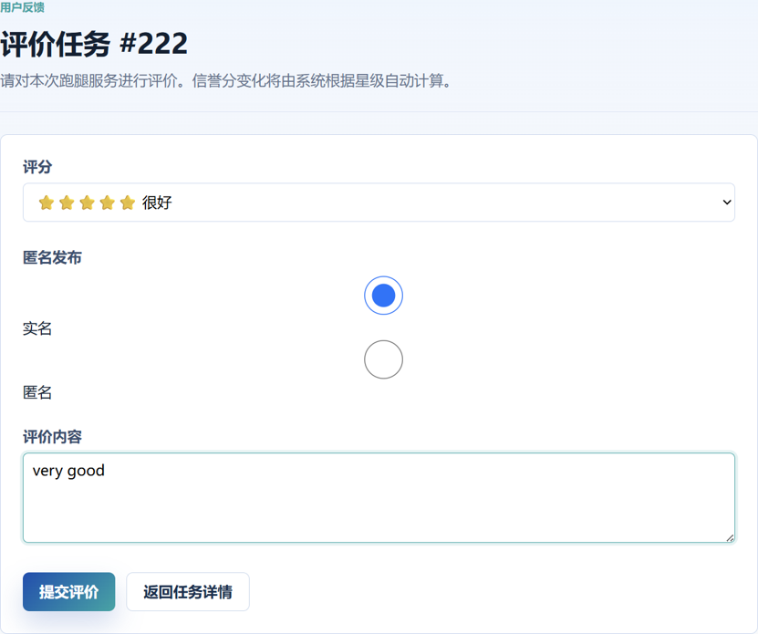

## TC-REVIEW-01 · 完成后评价

### 前置条件

任务 FINISHED 且支付 PAID

### 测试步骤

发布者提交 5 分评价

### 预期结果

`reviews` 新增记录，绑定最终接派记录；跑腿员信誉 +2

### 实际结果

reviews表新增记录21；跑腿员341信誉分由100变为102

### 结果

通过

### 证据

截图：

* SQL：

TC-REVIEW-01.txt
