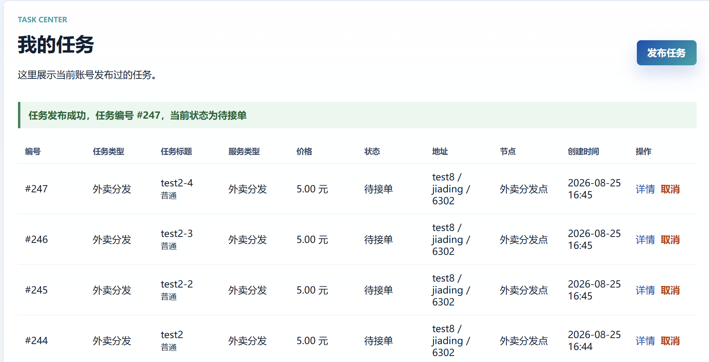
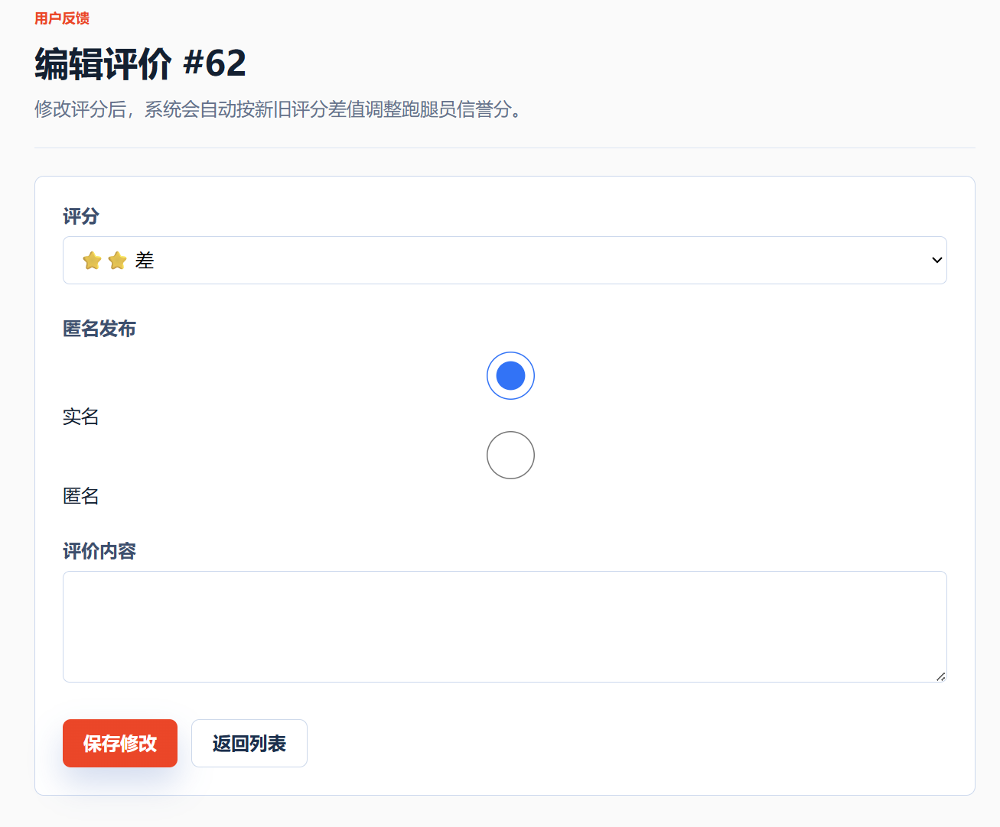
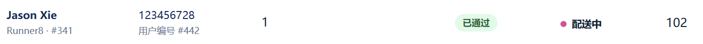

## TC-REVIEW-02 · 分数-信誉映射

### 前置条件

多条 FINISHED 任务

### 测试步骤

分别提交 4 / 3 / 2 / 1 分评价

### 预期结果

信誉变化依次 +1 / 0 / -1 / -2，与评价写入同一事务

### 实际结果

信誉变化依次 +1 / 0 / -1 / -2

### 结果

通过

### 证据

截图：

SQL：SQL/TC-REVIEW-02.txt
