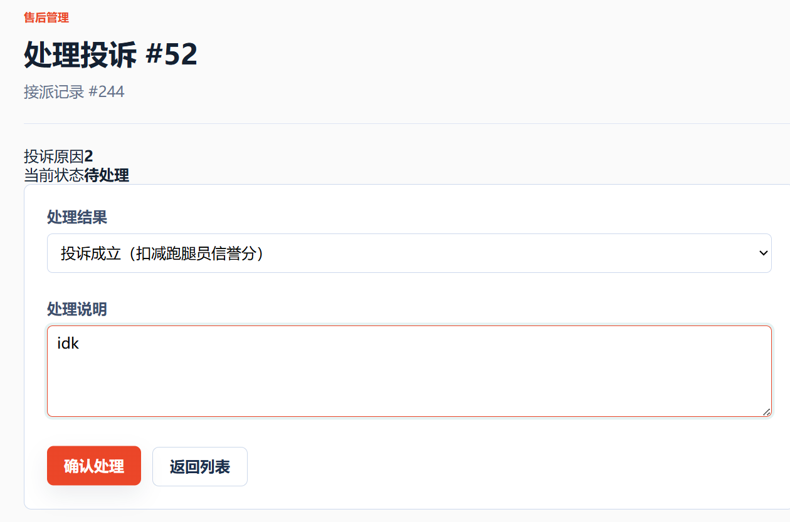

## TC-REVIEW-08 · 管理员处理投诉

### 前置条件

有 SUBMITTED 投诉

### 测试步骤

`/Complaint/Index` 受理并填写处理结果

### 预期结果

状态 SUBMITTED → PROCESSING → DONE，处理结果保存

### 实际结果
状态由SUBMITTED → PROCESSING → DONE

### 结果
通过 

### 证据

截图：

SQL：SQL/TC-REVIEW-08.txt
