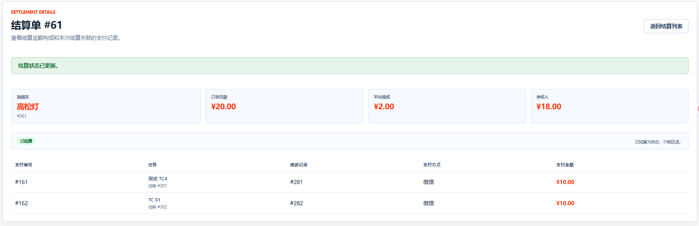
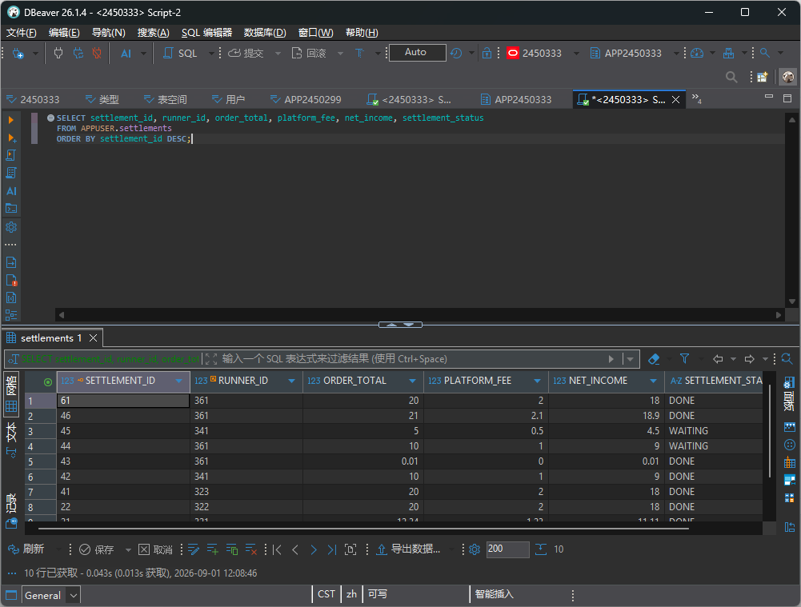
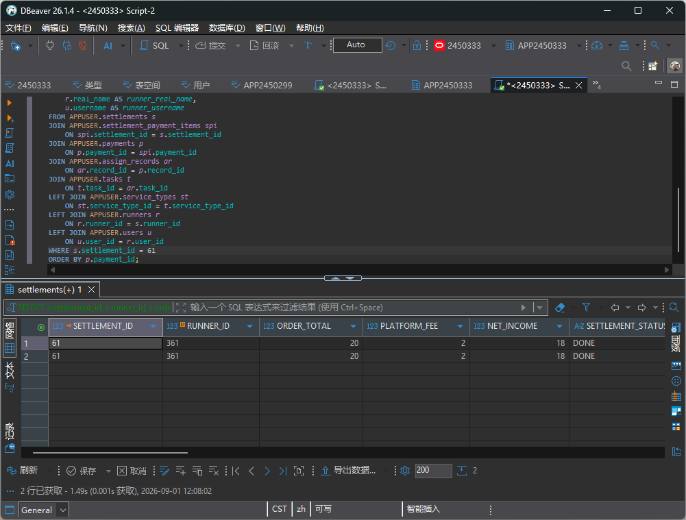
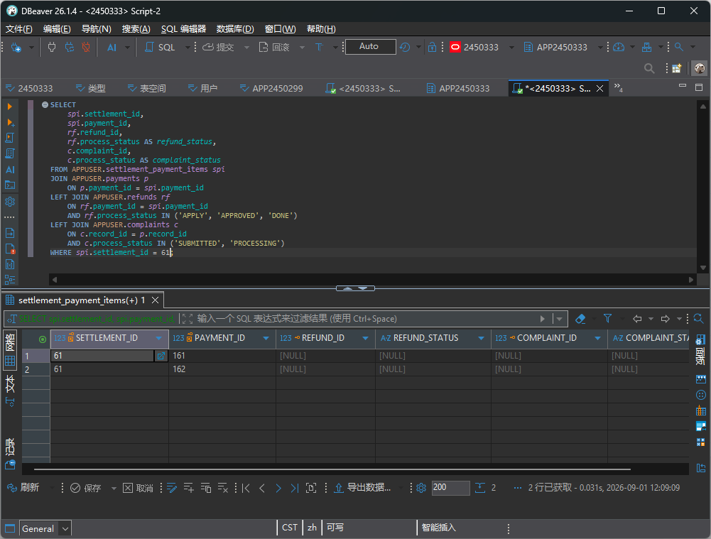

# TC-SETTLE-01：生成结算单

## 1. test-plan 原始要求

| 项目 | 内容 |
| --- | --- |
| 测试点 | 生成结算单 |
| 前置条件 | 跑腿员有 `PAID` 且无争议的支付记录 |
| 测试步骤 | `/Settlement` 为跑腿员生成结算单 |
| 预期结果 | `settlements` 状态为 `WAITING`；明细 `settlement_payment_items` 仅含该跑腿员、已支付、已完成、无活动退款的记录 |
| 证据 | 截图 + SQL |

## 2. 测试目标解释与最终口径

本用例验证管理员可以把“已经完成服务、已经付款、没有退款或投诉争议、尚未结算”的支付记录汇总成一张结算单。

当前系统的结算单由两部分组成：

- `APPUSER.settlements`：结算主表，保存跑腿员、订单总额、平台服务费、跑腿员净收入和结算状态。
- `APPUSER.settlement_payment_items`：结算明细表，保存本次结算单包含了哪些 `payment_id`。

本次测试按当前真实表结构执行。`docs/test-plan.md` 中参考 SQL 的 `total_amount` 字段在当前库中对应 `order_total`。

## 3. 前置条件与测试数据

- 管理员账号可登录系统。
- 至少存在一名跑腿员，其名下有可结算支付记录。
- 可结算支付记录应满足：`payments.pay_status = 'PAID'`，关联任务 `tasks.task_status = 'FINISHED'`，且没有活动退款、处理中投诉，也没有出现在历史结算明细中。

## 4. 页面操作步骤

1. 使用管理员账号登录。
2. 进入 `/Settlement`，查看结算首页。
3. 进入 `/Settlement/Candidates`，查看按跑腿员分组的候选支付记录。
4. 选择一个存在候选记录的跑腿员，点击生成结算单。
5. 页面跳转到 `/Settlement/Details/{settlement_id}`。
6. 查看结算状态、订单总额、平台服务费、净收入和支付明细。
7. 在 DBeaver 中执行 SQL，核对主表、明细表和来源业务数据。

## 5. SQL 验证

查询最近生成的结算单：

```sql
SELECT settlement_id, runner_id, order_total, platform_fee, net_income, settlement_status
FROM APPUSER.settlements
ORDER BY settlement_id DESC;
```

查询某张结算单的完整业务链路：

```sql
SELECT
    s.settlement_id,
    s.runner_id,
    s.order_total,
    s.platform_fee,
    s.net_income,
    s.settlement_status,
    spi.payment_id,
    p.record_id,
    p.order_amount,
    p.pay_amount,
    p.pay_method,
    p.pay_status,
    ar.task_id,
    ar.runner_id AS assign_runner_id,
    ar.operation_type,
    ar.assigned_at,
    t.task_title,
    t.task_price,
    t.task_status,
    t.created_at,
    t.completed_at,
    st.service_name,
    r.real_name AS runner_real_name,
    u.username AS runner_username
FROM APPUSER.settlements s
JOIN APPUSER.settlement_payment_items spi
    ON spi.settlement_id = s.settlement_id
JOIN APPUSER.payments p
    ON p.payment_id = spi.payment_id
JOIN APPUSER.assign_records ar
    ON ar.record_id = p.record_id
JOIN APPUSER.tasks t
    ON t.task_id = ar.task_id
LEFT JOIN APPUSER.service_types st
    ON st.service_type_id = t.service_type_id
LEFT JOIN APPUSER.runners r
    ON r.runner_id = s.runner_id
LEFT JOIN APPUSER.users u
    ON u.user_id = r.user_id
WHERE s.settlement_id = :sid
ORDER BY p.payment_id;
```

验证本次结算明细没有包含退款或投诉争议记录：

```sql
SELECT
    spi.settlement_id,
    spi.payment_id,
    rf.refund_id,
    rf.process_status AS refund_status,
    c.complaint_id,
    c.process_status AS complaint_status
FROM APPUSER.settlement_payment_items spi
JOIN APPUSER.payments p
    ON p.payment_id = spi.payment_id
LEFT JOIN APPUSER.refunds rf
    ON rf.payment_id = spi.payment_id
    AND rf.process_status IN ('APPLY', 'APPROVED', 'DONE')
LEFT JOIN APPUSER.complaints c
    ON c.record_id = p.record_id
    AND c.process_status IN ('SUBMITTED', 'PROCESSING')
WHERE spi.settlement_id = :sid;
```

预期：结算主表状态为 `WAITING`；明细中的 `pay_status` 均为 `PAID`，`task_status` 均为 `FINISHED`，`assign_runner_id` 与 `settlements.runner_id` 一致；退款和投诉字段为空。

## 6. 证据截图位置

### 页面截图




### SQL 截图

<!-- TODO: 放置 settlements 主表查询截图 -->


<!-- TODO: 放置结算明细完整链路查询截图 -->


<!-- TODO: 放置无活动退款/投诉验证截图 -->

## 7. 实际结果与结论

实际结果：页面生成成功，`settlements` 主表有结算汇总，`settlement_payment_items` 有来源支付明细，金额和状态正确。

结论：通过。
