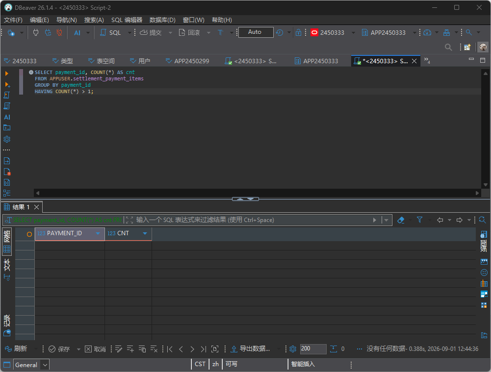

# TC-SETTLE-02：重复结算限制


### 测试目标

验证同一笔支付记录不会被重复结算。

### 实际操作

完整TC1后执行SQL

### 页面现象



### SQL

```sql
SELECT payment_id, COUNT(*) AS cnt
FROM APPUSER.settlement_payment_items
GROUP BY payment_id
HAVING COUNT(*) > 1;
```

### 实际结果

无查询结果，表示没有重复结算

### 结论

通过

