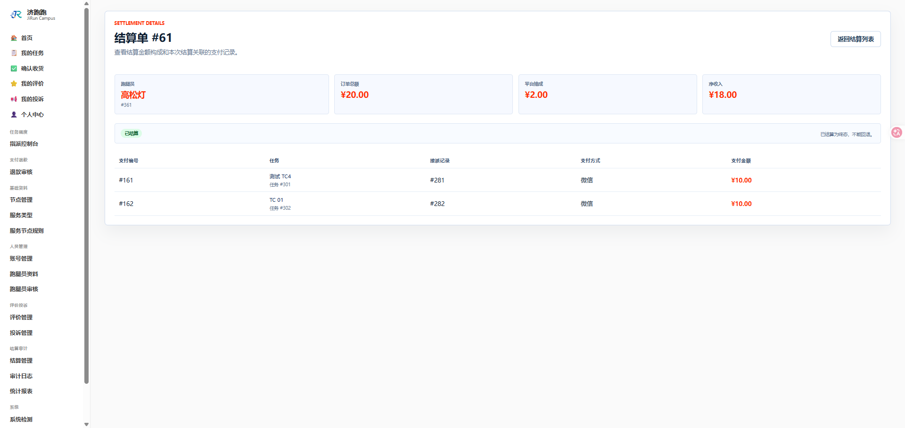
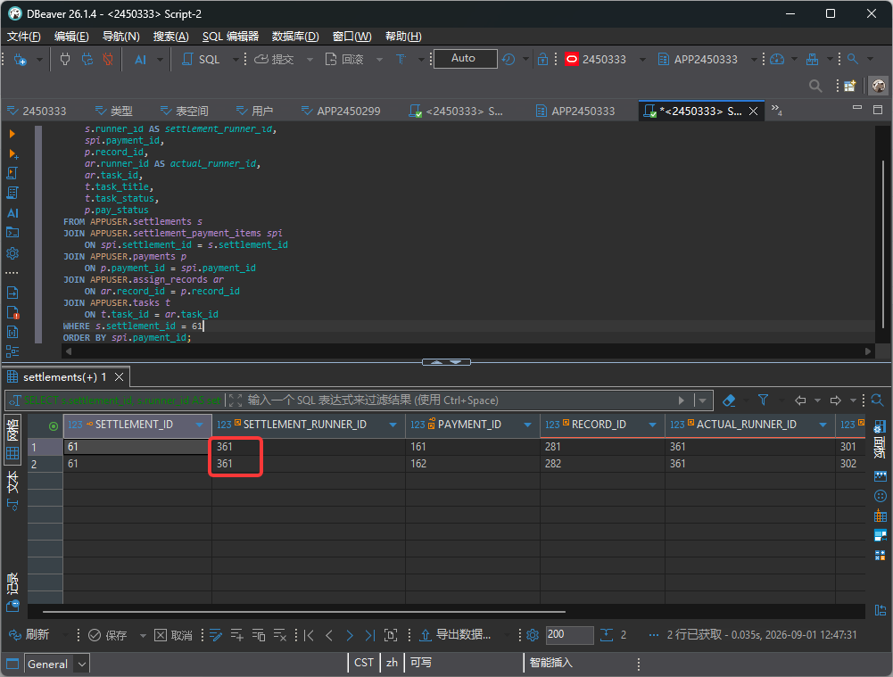
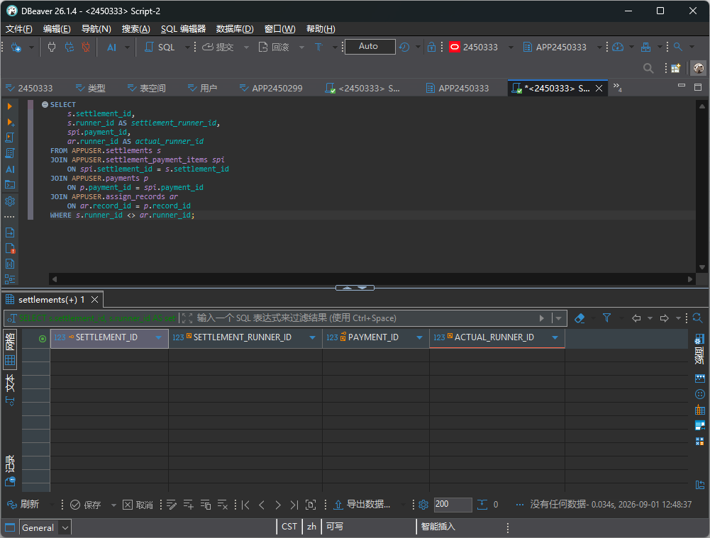

# TC-SETTLE-03：跑腿员归属校验

## 1. test-plan 原始要求

| 项目 | 内容 |
| --- | --- |
| 测试点 | 跑腿员归属校验 |
| 前置条件 | 支付记录属于跑腿员 A |
| 测试步骤 | 尝试给跑腿员 B 结算该支付 |
| 预期结果 | 校验拒绝 |
| 证据 | 截图 |

## 2. 测试目标解释与最终口径

本用例验证结算单不能把跑腿员 A 完成的支付错误结算给跑腿员 B。

当前系统没有提供“管理员手动指定某个 `payment_id` 结算给另一个跑腿员”的页面入口，后端会根据 `assign_records.runner_id` 自动按跑腿员分组生成候选。因此本用例按以下口径执行：

- 结算详情中的每条支付明细，其 `assign_records.runner_id` 必须等于 `settlements.runner_id`。
- 跑腿员端只能访问自己的结算详情，不能通过修改 URL 查看其他跑腿员的结算。

## 3. 前置条件与测试数据

- 已存在至少一张结算单。
- 最好准备两个不同跑腿员账号，便于验证跑腿员端权限隔离。

## 4. 页面操作步骤

1. 管理员登录，进入 `/Settlement`。
2. 打开某张结算单详情 `/Settlement/Details/{settlement_id}`。
3. 查看结算单归属跑腿员和明细中的支付记录。
4. 使用 SQL 验证明细来源的 `runner_id` 与结算主表 `runner_id` 一致。
5. 使用跑腿员账号登录，进入 `/Settlement/My`。
6. 尝试访问其他跑腿员结算详情 `/Settlement/MyDetails/{other_settlement_id}`。
7. 预期系统返回无权限、未找到，或不展示他人结算数据。

## 5. SQL 验证

查询某张结算单的归属一致性：

```sql
SELECT
    s.settlement_id,
    s.runner_id AS settlement_runner_id,
    spi.payment_id,
    p.record_id,
    ar.runner_id AS actual_runner_id,
    ar.task_id,
    t.task_title,
    t.task_status,
    p.pay_status
FROM APPUSER.settlements s
JOIN APPUSER.settlement_payment_items spi
    ON spi.settlement_id = s.settlement_id
JOIN APPUSER.payments p
    ON p.payment_id = spi.payment_id
JOIN APPUSER.assign_records ar
    ON ar.record_id = p.record_id
JOIN APPUSER.tasks t
    ON t.task_id = ar.task_id
WHERE s.settlement_id = :sid
ORDER BY spi.payment_id;
```

检查全库是否存在结算归属不一致的数据：

```sql
SELECT
    s.settlement_id,
    s.runner_id AS settlement_runner_id,
    spi.payment_id,
    ar.runner_id AS actual_runner_id
FROM APPUSER.settlements s
JOIN APPUSER.settlement_payment_items spi
    ON spi.settlement_id = s.settlement_id
JOIN APPUSER.payments p
    ON p.payment_id = spi.payment_id
JOIN APPUSER.assign_records ar
    ON ar.record_id = p.record_id
WHERE s.runner_id <> ar.runner_id;
```

预期：第一条 SQL 中两个跑腿员编号一致；第二条 SQL 无结果。

## 6. 证据截图位置

### 页面截图



### SQL 截图

<!-- TODO: 放置结算归属一致性 SQL 截图 -->

<!-- TODO: 放置全库归属不一致检查 SQL 截图 -->


## 7. 实际结果与结论

实际结果：结算数据归属正确，未发现跨跑腿员错误归属。

结论：通过。
