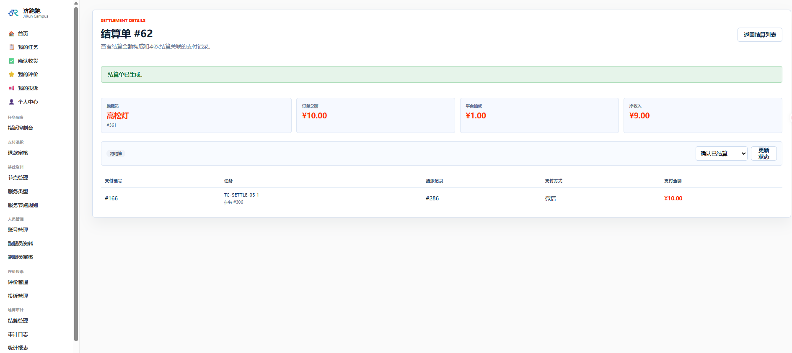
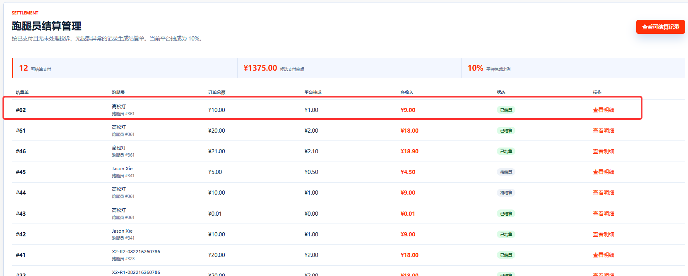
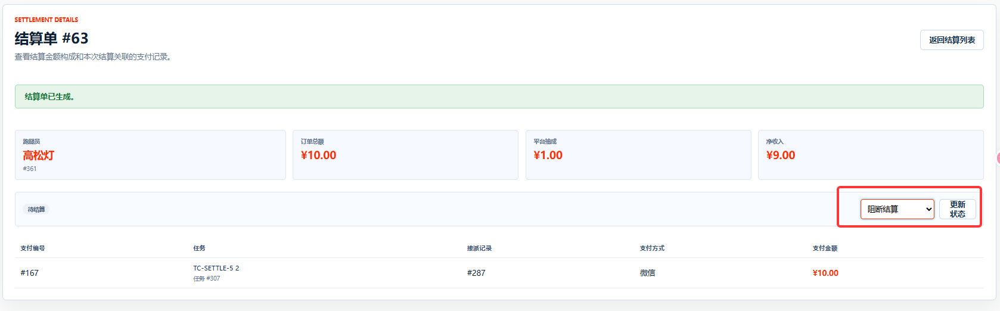
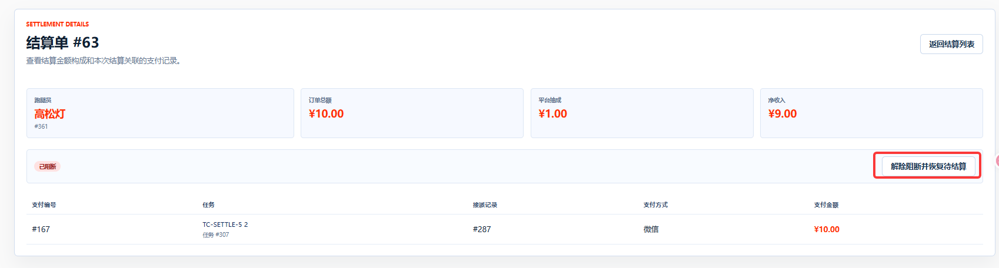
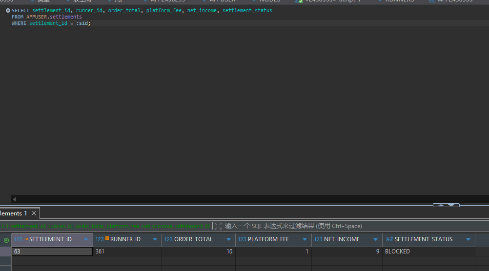
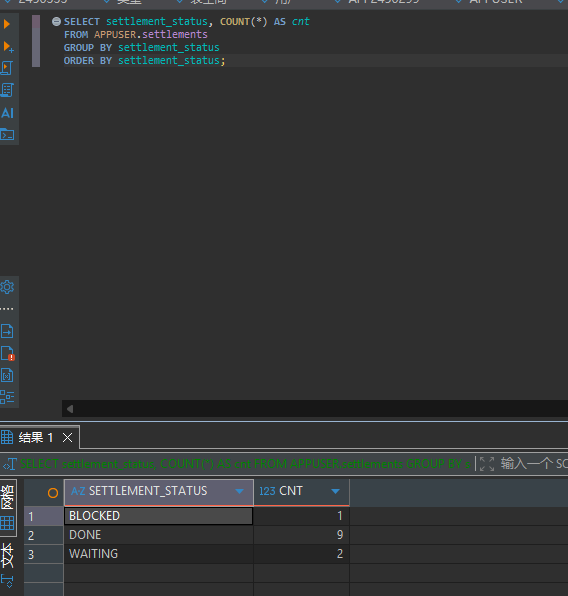

# TC-SETTLE-05：结算状态机

## 1. test-plan 原始要求

| 项目 | 内容 |
| --- | --- |
| 测试点 | 结算状态机 |
| 前置条件 | 一条 `WAITING` 结算单 |
| 测试步骤 | 执行完成 -> 尝试再次变更；再建一条置为 `BLOCKED` -> 恢复 |
| 预期结果 | 仅允许 `WAITING -> DONE`、`WAITING -> BLOCKED`、`BLOCKED -> WAITING`；`DONE` 为终态不可改 |
| 证据 | 截图 + SQL |

## 2. 测试目标解释与最终口径

本用例验证结算单状态不能随意修改。结算属于财务确认动作，`DONE` 表示结算已经完成，应作为终态；`BLOCKED` 表示暂时阻断，允许恢复到 `WAITING` 后继续处理。

当前系统支持的状态为：

- `WAITING`：待结算。
- `DONE`：已结算，终态。
- `BLOCKED`：阻断，需恢复后才能继续。

当前系统没有单独的结算状态历史表，因此本用例主要通过页面提示和 `settlements.settlement_status` 当前值验证状态机。

## 3. 前置条件与测试数据

- 至少准备两张 `WAITING` 状态结算单。
- 如果只有一张 `WAITING` 结算单，建议先完成 `TC-SETTLE-01` 再生成一张新的测试结算单。

## 4. 页面操作步骤

1. 管理员登录，进入 `/Settlement`。
2. 打开第一张 `WAITING` 结算单详情。
3. 点击将状态变更为 `DONE`。
4. 刷新页面或重新进入详情，确认状态为 `DONE`。
5. 尝试把该 `DONE` 结算单改为 `BLOCKED` 或 `WAITING`，预期系统拒绝并提示 `DONE` 为终态。
6. 打开第二张 `WAITING` 结算单详情。
7. 点击将状态变更为 `BLOCKED`。
8. 确认状态为 `BLOCKED`。
9. 再将其从 `BLOCKED` 恢复为 `WAITING`。
10. 使用 SQL 查询最终状态。

## 5. SQL 验证

查询指定结算单状态：

```sql
SELECT settlement_id, runner_id, order_total, platform_fee, net_income, settlement_status
FROM APPUSER.settlements
WHERE settlement_id = :sid;
```

查询不同状态结算单数量，辅助确认状态变化：

```sql
SELECT settlement_status, COUNT(*) AS cnt
FROM APPUSER.settlements
GROUP BY settlement_status
ORDER BY settlement_status;
```

查询最近结算单，选择用于测试的 `WAITING` 数据：

```sql
SELECT settlement_id, runner_id, settlement_status
FROM APPUSER.settlements
ORDER BY settlement_id DESC
FETCH FIRST 20 ROWS ONLY;
```

预期：`WAITING -> DONE` 成功；`DONE` 再变更失败；`WAITING -> BLOCKED` 成功；`BLOCKED -> WAITING` 成功。

## 6. 证据截图位置

### 页面截图

<!-- TODO: 放置 WAITING 结算单详情截图 -->

<!-- TODO: 放置 WAITING -> DONE 成功截图 -->

<!-- TODO: 放置 DONE 再变更被拒绝的提示截图 -->

<!-- TODO: 放置 WAITING -> BLOCKED 与 BLOCKED -> WAITING 的截图 -->


### SQL 截图

<!-- TODO: 放置结算单最终状态查询截图 -->



<!-- TODO: 放置状态分布统计截图 -->

## 7. 实际结果与结论

实际结果：通过。

结论：待填写：通过 / 失败 / 阻塞 / 需确认。
