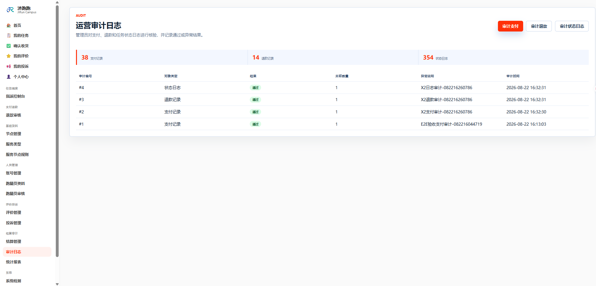
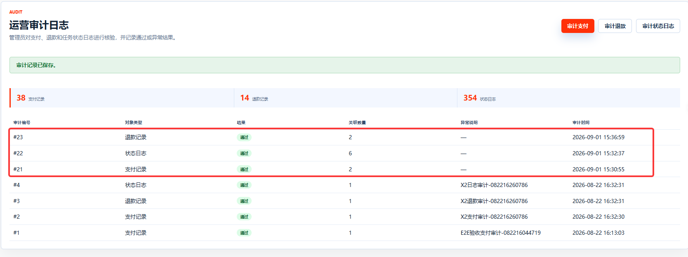
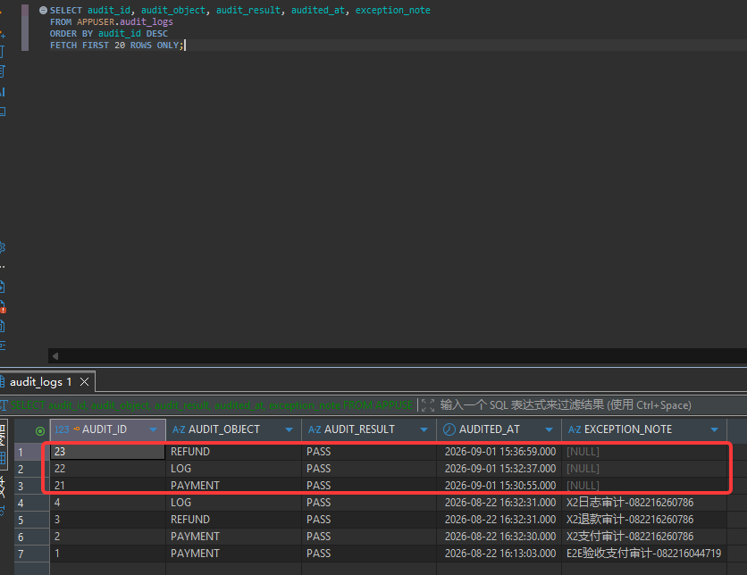
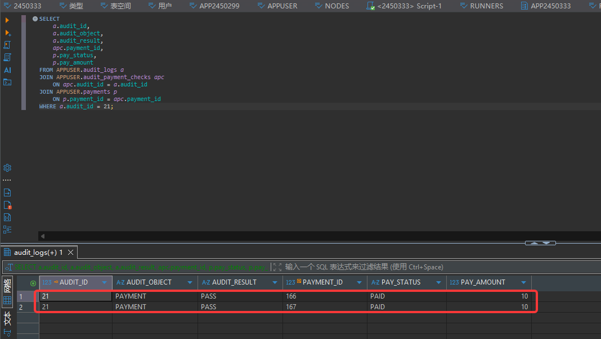
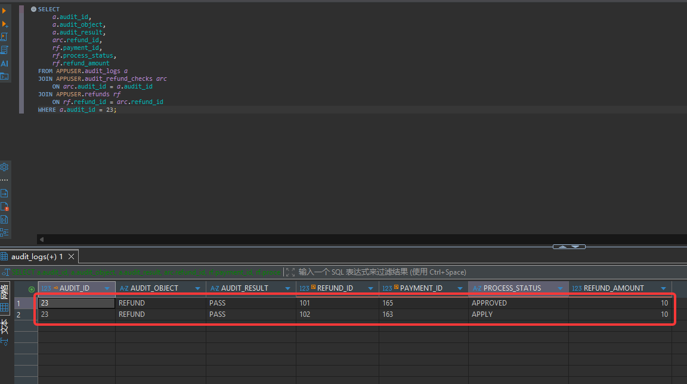

# TC-SETTLE-06：三类审计

## 1. test-plan 原始要求

| 项目 | 内容 |
| --- | --- |
| 测试点 | 三类审计 |
| 前置条件 | 已有日志、支付、退款记录 |
| 测试步骤 | `/Audit` 分别审计 `LOG`、`PAYMENT`、`REFUND` |
| 预期结果 | `audit_logs` 与对应明细表同事务写入，结果 `PASS` / `ABNORMAL` 正确 |
| 证据 | 截图 + SQL |

## 2. 测试目标解释与最终口径

本用例验证管理员审计功能是否能对三类对象生成审计记录，并写入对应的关联表。

当前系统采用“审计主表 + 类型明细表”的设计：

- `audit_logs` 保存审计主记录，包括审计对象、审计结果、审计时间、异常说明。
- `audit_payment_checks` 关联被审计的支付记录。
- `audit_refund_checks` 关联被审计的退款记录。
- `audit_status_log_checks` 关联被审计的任务状态日志。

“同事务写入”的含义是：创建审计时，主表和明细表要一起成功；如果明细写入失败，主表也不应留下孤立审计记录。

## 3. 前置条件与测试数据

- 管理员账号可登录。
- 数据库中至少存在：
  - 一条 `payments` 记录。
  - 一条 `refunds` 记录。
  - 一条 `task_status_logs` 记录。
- 如果某一类对象没有候选记录，该类型审计应记录为“阻塞：缺少测试数据”。

## 4. 页面操作步骤

1. 管理员登录，进入 `/Audit`。
2. 点击或访问 `/Audit/Create?auditObject=PAYMENT`。
3. 选择至少一条支付记录，设置审计结果为 `PASS` 或 `ABNORMAL`，必要时填写异常说明，提交。
4. 回到 `/Audit`，确认最新审计记录出现。
5. 对 `/Audit/Create?auditObject=REFUND` 重复上述流程。
6. 对 `/Audit/Create?auditObject=LOG` 重复上述流程。
7. 使用 SQL 查询 `audit_logs` 和三张关联表，确认主表与明细表数据一致。

## 5. SQL 验证

查询最近审计主记录：

```sql
SELECT audit_id, audit_object, audit_result, audited_at, exception_note
FROM APPUSER.audit_logs
ORDER BY audit_id DESC
FETCH FIRST 20 ROWS ONLY;
```

查询支付审计关联：

```sql
SELECT
    a.audit_id,
    a.audit_object,
    a.audit_result,
    apc.payment_id,
    p.pay_status,
    p.pay_amount
FROM APPUSER.audit_logs a
JOIN APPUSER.audit_payment_checks apc
    ON apc.audit_id = a.audit_id
JOIN APPUSER.payments p
    ON p.payment_id = apc.payment_id
WHERE a.audit_id = :audit_id;
```

查询退款审计关联：

```sql
SELECT
    a.audit_id,
    a.audit_object,
    a.audit_result,
    arc.refund_id,
    rf.payment_id,
    rf.process_status,
    rf.refund_amount
FROM APPUSER.audit_logs a
JOIN APPUSER.audit_refund_checks arc
    ON arc.audit_id = a.audit_id
JOIN APPUSER.refunds rf
    ON rf.refund_id = arc.refund_id
WHERE a.audit_id = :audit_id;
```

查询状态日志审计关联：

```sql
SELECT
    a.audit_id,
    a.audit_object,
    a.audit_result,
    aslc.log_id,
    tsl.record_id,
    tsl.old_status,
    tsl.new_status,
    tsl.changed_at
FROM APPUSER.audit_logs a
JOIN APPUSER.audit_status_log_checks aslc
    ON aslc.audit_id = a.audit_id
JOIN APPUSER.task_status_logs tsl
    ON tsl.log_id = aslc.log_id
WHERE a.audit_id = :audit_id;
```

预期：每一类审计都能在 `audit_logs` 中找到主记录，并在对应关联表中找到所选目标对象。

## 6. 证据截图位置

### 页面截图

<!-- TODO: 放置 Audit 首页截图 -->



<!-- TODO: 放置 PAYMENT 审计提交成功截图 -->

<!-- TODO: 放置 REFUND 审计提交成功截图 -->

<!-- TODO: 放置 LOG 审计提交成功截图 -->

### SQL 截图

<!-- TODO: 放置 audit_logs 最近记录截图 -->

<!-- TODO: 放置 audit_payment_checks 关联查询截图 -->

<!-- TODO: 放置 audit_refund_checks 关联查询截图 -->

<!-- TODO: 放置 audit_status_log_checks 关联查询截图 -->

## 7. 实际结果与结论

实际结果：通过。

结论：待填写：通过 / 失败 / 阻塞 / 需确认。
