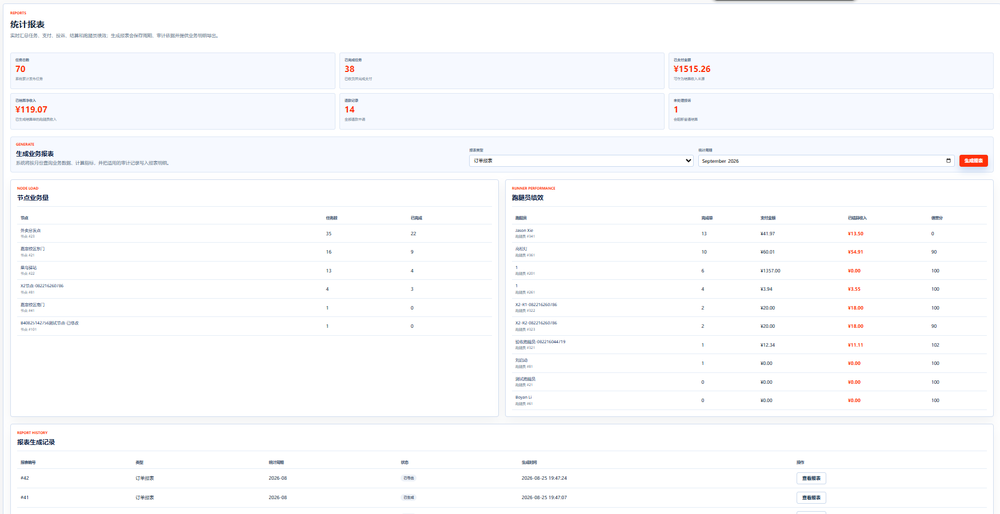
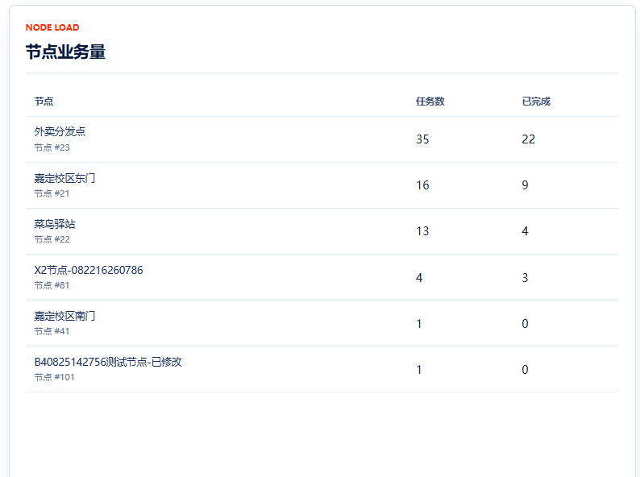
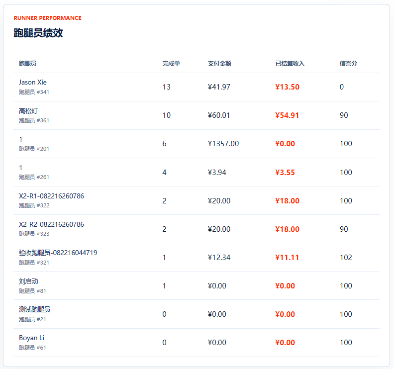
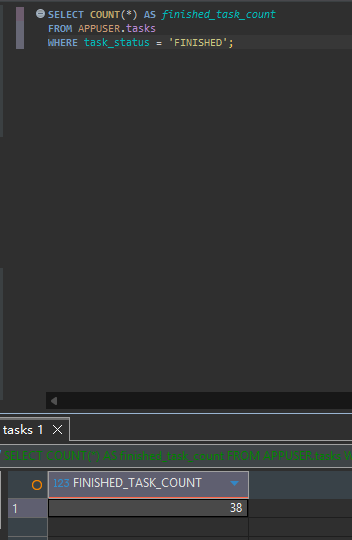
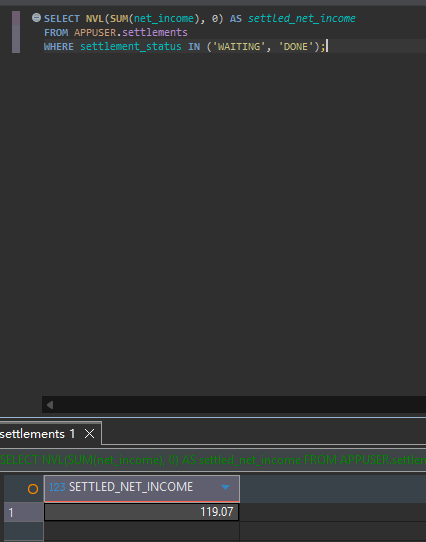
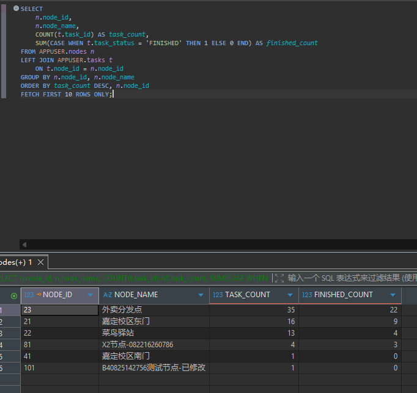
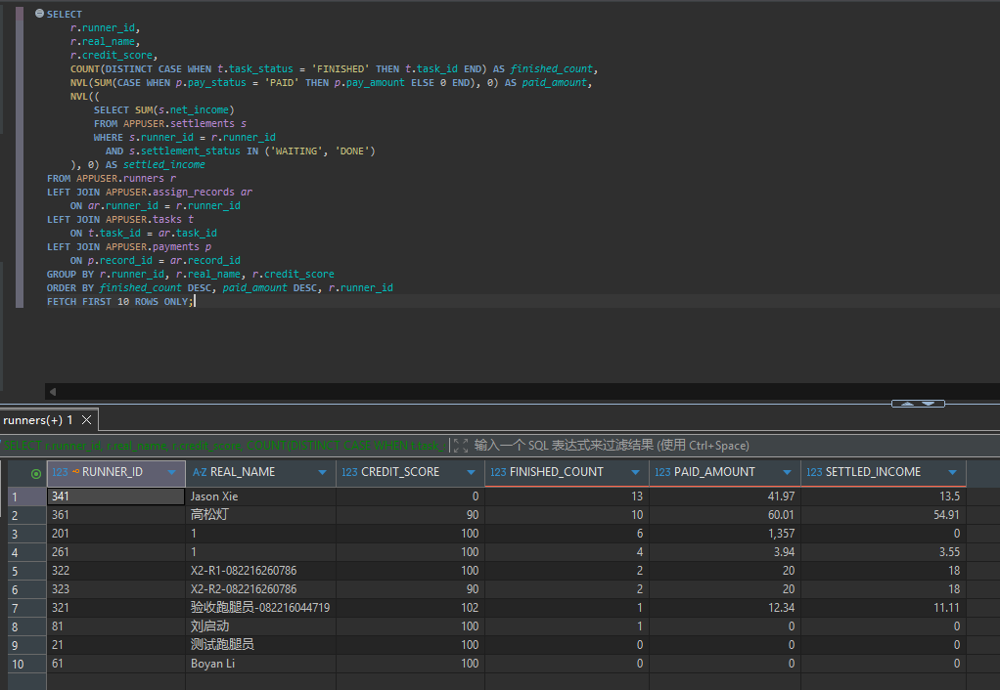

# TC-SETTLE-07：统计面板

## 1. test-plan 原始要求

| 项目 | 内容 |
| --- | --- |
| 测试点 | 统计面板 |
| 前置条件 | 有业务数据 |
| 测试步骤 | `/Report` 查看面板 |
| 预期结果 | 指标与 SQL 手算一致 |
| 证据 | 截图 |

## 2. 测试目标解释与最终口径

本用例验证报表首页展示的统计指标来自数据库真实汇总，而不是页面写死或口径错误。

当前 `/Report` 面板主要展示：

- 任务总数。
- 已完成任务。
- 已支付金额。
- 已结算净收入。
- 退款记录数。
- 未处理投诉数。
- 节点任务量排行。
- 跑腿员表现排行。

最终测试口径是：页面显示的核心指标应与 SQL 查询结果一致；排行类数据至少抽查前几行是否与 SQL 结果一致。

## 3. 前置条件与测试数据

- 管理员账号可登录。
- 数据库中已有任务、支付、结算、退款、投诉等业务数据。
- 如果某类数据为空，对应指标应显示为 0，而不是页面异常。

## 4. 页面操作步骤

1. 管理员登录。
2. 进入 `/Report`。
3. 截图记录统计面板的核心指标。
4. 记录节点任务量排行和跑腿员表现排行前几行。
5. 在 DBeaver 中执行 SQL 手算指标。
6. 对比页面数值与 SQL 结果。

## 5. SQL 验证

核心指标：

```sql
SELECT COUNT(*) AS task_count
FROM APPUSER.tasks;
```

```sql
SELECT COUNT(*) AS finished_task_count
FROM APPUSER.tasks
WHERE task_status = 'FINISHED';
```

```sql
SELECT NVL(SUM(pay_amount), 0) AS paid_amount
FROM APPUSER.payments
WHERE pay_status = 'PAID';
```

```sql
SELECT NVL(SUM(net_income), 0) AS settled_net_income
FROM APPUSER.settlements
WHERE settlement_status IN ('WAITING', 'DONE');
```

```sql
SELECT COUNT(*) AS refund_count
FROM APPUSER.refunds;
```

```sql
SELECT COUNT(*) AS pending_complaint_count
FROM APPUSER.complaints
WHERE process_status IN ('SUBMITTED', 'PROCESSING');
```

节点任务量排行：

```sql
SELECT
    n.node_id,
    n.node_name,
    COUNT(t.task_id) AS task_count,
    SUM(CASE WHEN t.task_status = 'FINISHED' THEN 1 ELSE 0 END) AS finished_count
FROM APPUSER.nodes n
LEFT JOIN APPUSER.tasks t
    ON t.node_id = n.node_id
GROUP BY n.node_id, n.node_name
ORDER BY task_count DESC, n.node_id
FETCH FIRST 10 ROWS ONLY;
```

跑腿员表现排行：

```sql
SELECT
    r.runner_id,
    r.real_name,
    r.credit_score,
    COUNT(DISTINCT CASE WHEN t.task_status = 'FINISHED' THEN t.task_id END) AS finished_count,
    NVL(SUM(CASE WHEN p.pay_status = 'PAID' THEN p.pay_amount ELSE 0 END), 0) AS paid_amount,
    NVL((
        SELECT SUM(s.net_income)
        FROM APPUSER.settlements s
        WHERE s.runner_id = r.runner_id
          AND s.settlement_status IN ('WAITING', 'DONE')
    ), 0) AS settled_income
FROM APPUSER.runners r
LEFT JOIN APPUSER.assign_records ar
    ON ar.runner_id = r.runner_id
LEFT JOIN APPUSER.tasks t
    ON t.task_id = ar.task_id
LEFT JOIN APPUSER.payments p
    ON p.record_id = ar.record_id
GROUP BY r.runner_id, r.real_name, r.credit_score
ORDER BY finished_count DESC, paid_amount DESC, r.runner_id
FETCH FIRST 10 ROWS ONLY;
```

## 6. 证据截图位置

### 页面截图

<!-- TODO: 放置 /Report 统计面板截图 -->

<!-- TODO: 放置节点任务量排行截图 -->

<!-- TODO: 放置跑腿员表现排行截图 -->

### SQL 截图

<!-- TODO: 放置核心指标 SQL 查询截图 -->





<!-- TODO: 放置排行 SQL 查询截图 -->





## 7. 实际结果与结论

实际结果：通过。

结论：待填写：通过 / 失败 / 阻塞 / 需确认。
