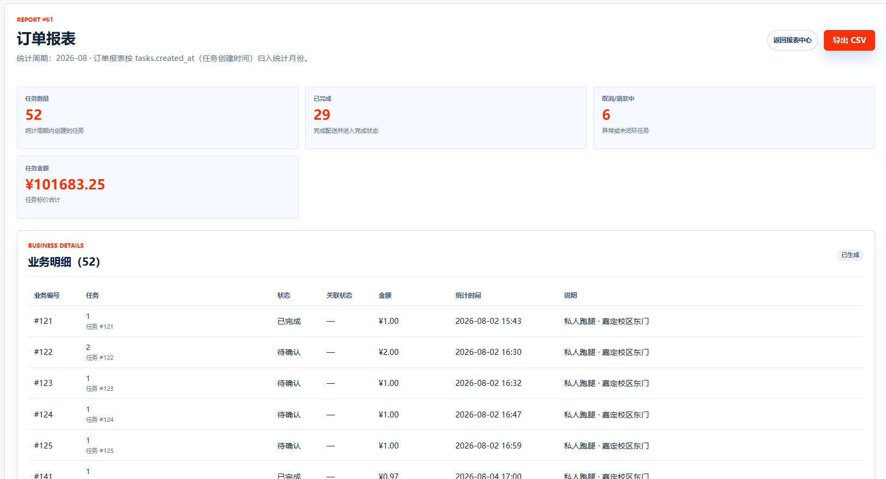
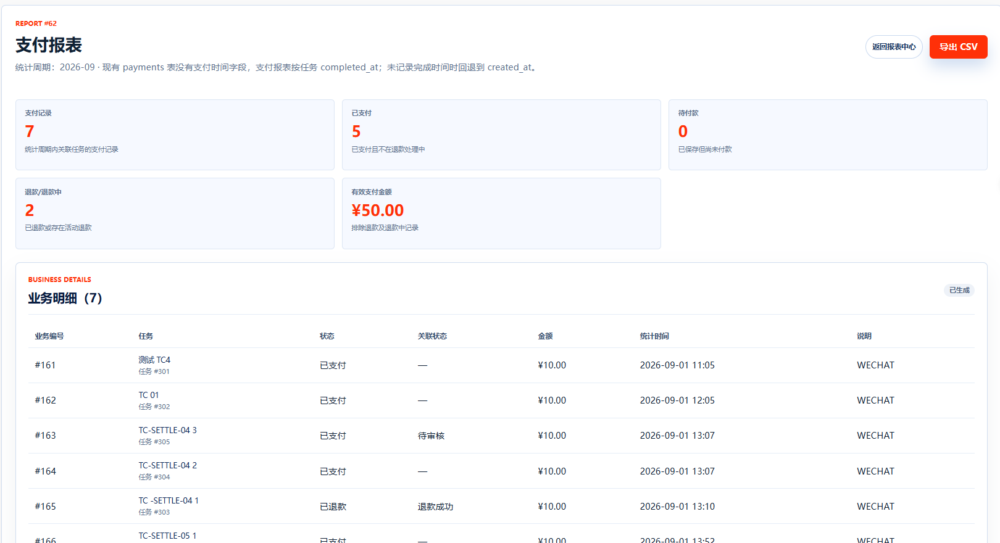
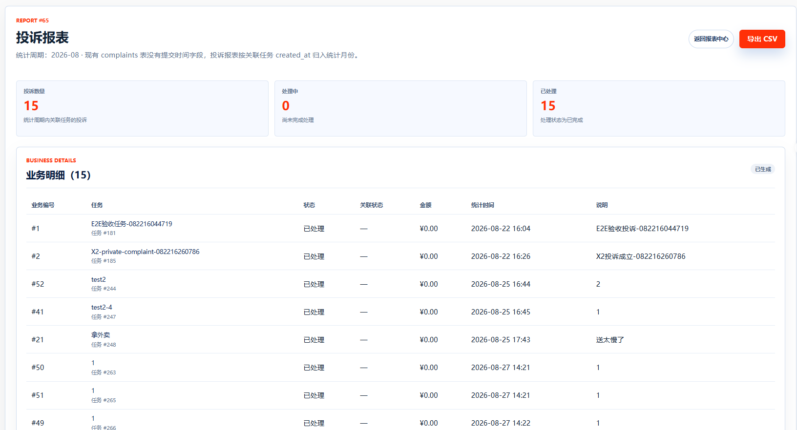
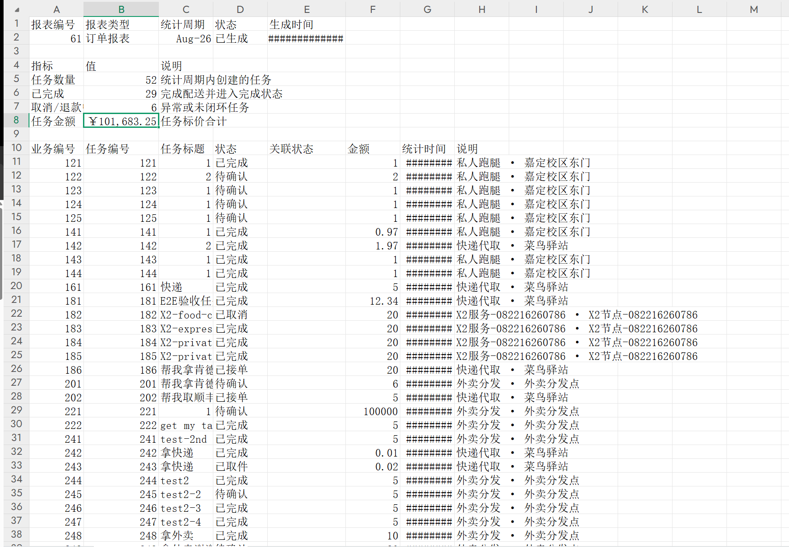
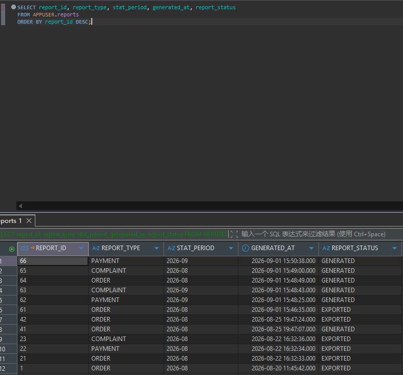
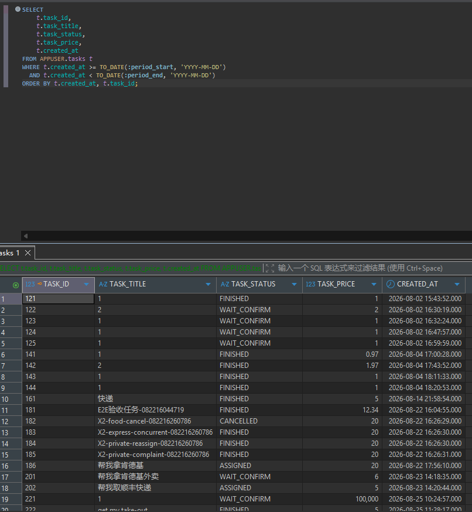
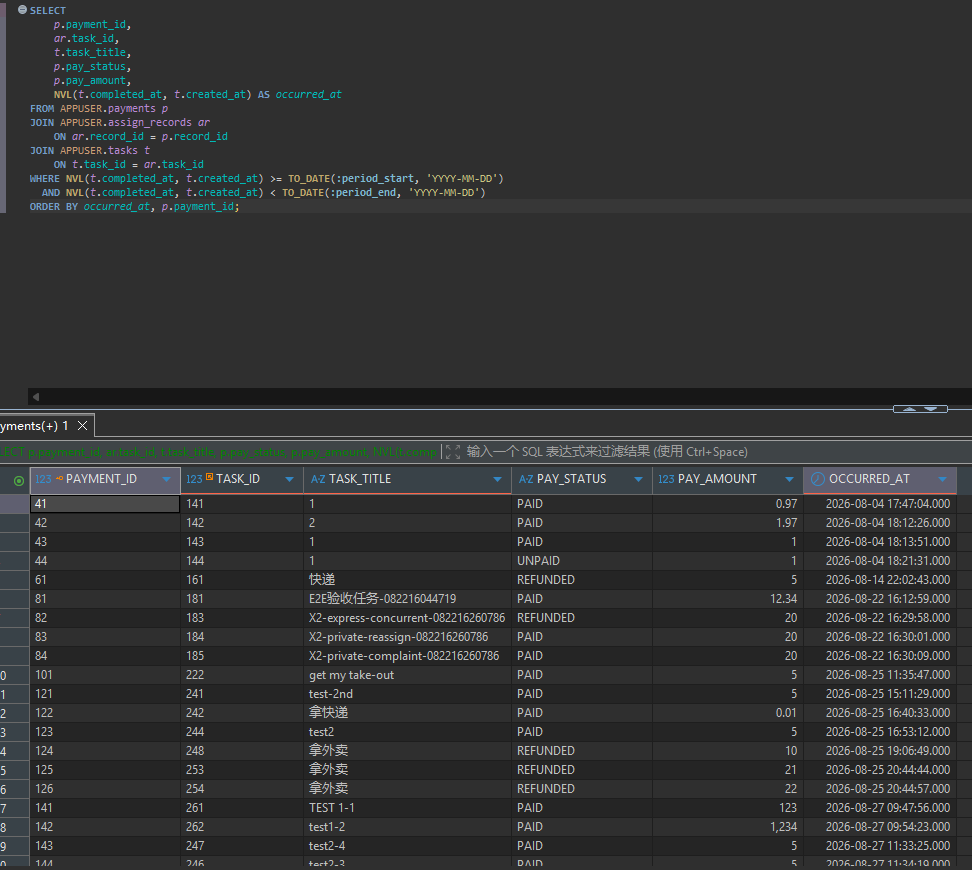

# TC-SETTLE-08：报表生成与导出

## 1. test-plan 原始要求

| 项目 | 内容 |
| --- | --- |
| 测试点 | 报表生成与导出 |
| 前置条件 | 有历史业务数据 |
| 测试步骤 | 生成 `ORDER` / `PAYMENT` / `COMPLAINT` 三类报表并导出 |
| 预期结果 | 按 `yyyy-MM` 归集；导出 UTF-8 CSV；状态 `GENERATED -> EXPORTED`；页面注明支付/投诉时间口径 |
| 证据 | 截图 + 导出文件 |

## 2. 测试目标解释与最终口径

本用例验证管理员可以按月份生成订单、支付、投诉三类统计报表，并导出 CSV 文件。

当前实现支持的报表类型为：

- `ORDER`：按 `tasks.created_at` 归入统计月份。
- `PAYMENT`：由于 `payments` 表没有独立支付时间字段，按关联任务 `completed_at` 归入统计月份；没有完成时间时回退到 `created_at`。
- `COMPLAINT`：由于 `complaints` 表没有独立提交时间字段，按关联任务 `created_at` 归入统计月份。

当前实现中，生成报表后状态为 `GENERATED`；点击导出后返回 UTF-8 CSV 文件，并把状态更新为 `EXPORTED`。

另外，当前报表的审计依据关联按现有后端实现执行：`ORDER` 报表关联 `LOG` 审计，`PAYMENT` 报表关联 `PAYMENT` 和 `REFUND` 审计；`COMPLAINT` 报表主要验证投诉业务明细、指标和导出结果，不强制要求存在审计依据关联。

## 3. 前置条件与测试数据

- 管理员账号可登录。
- 至少选择一个存在业务数据的月份，例如 `2026-08`。
- 数据库中最好已有任务、支付、投诉和审计记录。若某类业务数据为空，报表仍可生成，但业务明细数量可能为 0。

## 4. 页面操作步骤

1. 管理员登录，进入 `/Report`。
2. 在报表生成区域选择 `ORDER`，填写统计月份，点击生成。
3. 进入报表详情页，检查统计周期、指标、业务明细和时间口径说明。
4. 点击导出 CSV，确认浏览器下载文件。
5. 用记事本、Excel 或编辑器打开 CSV，确认内容可读、中文不乱码。
6. 回到报表详情或使用 SQL 查询，确认状态已从 `GENERATED` 更新为 `EXPORTED`。
7. 分别对 `PAYMENT` 和 `COMPLAINT` 重复上述流程。

## 5. SQL 验证

查询最近生成的报表：

```sql
SELECT report_id, report_type, stat_period, generated_at, report_status
FROM APPUSER.reports
ORDER BY report_id DESC;
```

查询报表关联的审计依据：

```sql
SELECT
    rai.report_id,
    rai.audit_id,
    a.audit_object,
    a.audit_result,
    a.audited_at
FROM APPUSER.report_audit_items rai
JOIN APPUSER.audit_logs a
    ON a.audit_id = rai.audit_id
WHERE rai.report_id = :report_id
ORDER BY rai.audit_id;
```

手算订单报表业务明细：

```sql
SELECT
    t.task_id,
    t.task_title,
    t.task_status,
    t.task_price,
    t.created_at
FROM APPUSER.tasks t
WHERE t.created_at >= TO_DATE(:period_start, 'YYYY-MM-DD')
  AND t.created_at < TO_DATE(:period_end, 'YYYY-MM-DD')
ORDER BY t.created_at, t.task_id;
```

手算支付报表业务明细：

```sql
SELECT
    p.payment_id,
    ar.task_id,
    t.task_title,
    p.pay_status,
    p.pay_amount,
    NVL(t.completed_at, t.created_at) AS occurred_at
FROM APPUSER.payments p
JOIN APPUSER.assign_records ar
    ON ar.record_id = p.record_id
JOIN APPUSER.tasks t
    ON t.task_id = ar.task_id
WHERE NVL(t.completed_at, t.created_at) >= TO_DATE(:period_start, 'YYYY-MM-DD')
  AND NVL(t.completed_at, t.created_at) < TO_DATE(:period_end, 'YYYY-MM-DD')
ORDER BY occurred_at, p.payment_id;
```

手算投诉报表业务明细：

```sql
SELECT
    c.complaint_id,
    ar.task_id,
    t.task_title,
    c.process_status,
    c.reason,
    t.created_at AS occurred_at
FROM APPUSER.complaints c
JOIN APPUSER.assign_records ar
    ON ar.record_id = c.record_id
JOIN APPUSER.tasks t
    ON t.task_id = ar.task_id
WHERE t.created_at >= TO_DATE(:period_start, 'YYYY-MM-DD')
  AND t.created_at < TO_DATE(:period_end, 'YYYY-MM-DD')
ORDER BY t.created_at, c.complaint_id;
```

预期：三类报表均可生成；导出后 `report_status = 'EXPORTED'`；CSV 中文可读；页面时间口径与上述 SQL 一致。

## 6. 证据截图位置

### 页面截图

<!-- TODO: 放置 ORDER 报表生成成功截图 -->

<!-- TODO: 放置 PAYMENT 报表生成成功截图 -->

<!-- TODO: 放置 COMPLAINT 报表生成成功截图 -->

<!-- TODO: 放置报表详情中时间口径说明截图 -->

<!-- TODO: 放置导出后 CSV 文件内容截图 -->

### SQL 截图

<!-- TODO: 放置 reports 状态查询截图 -->

<!-- TODO: 放置 report_audit_items 查询截图 -->

<!-- TODO: 放置三类报表业务明细手算 SQL 截图 -->




## 7. 实际结果与结论

实际结果：通过。

结论：待填写：通过 / 失败 / 阻塞 / 需确认。
