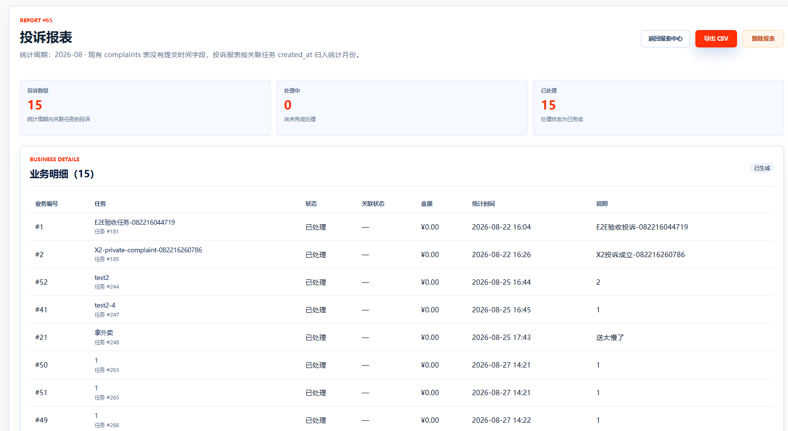
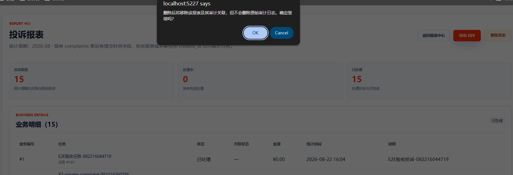
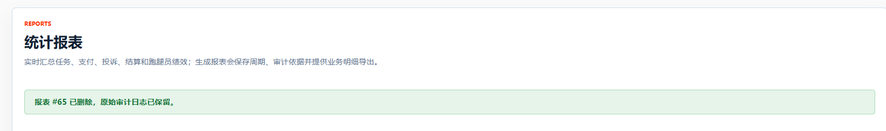
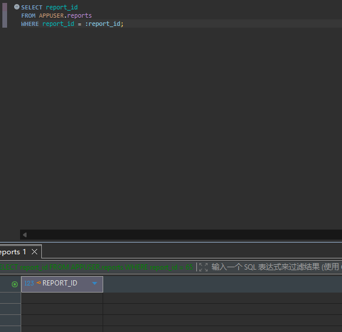

# TC-SETTLE-09：删除报表不动审计

## 1. test-plan 原始要求

| 项目 | 内容 |
| --- | --- |
| 测试点 | 删除报表不动审计 |
| 前置条件 | 已生成报表 |
| 测试步骤 | 删除报表 |
| 预期结果 | 仅删报表及关联，`audit_logs` 保留 |
| 证据 | SQL + 结果 |

## 2. 测试目标解释与最终口径

本用例验证“报表可以删除，但审计日志作为原始证据不能被删除”。这是合理的数据库设计要求：报表是二次汇总结果，可以由管理员清理；审计日志是管理员对关键业务数据的核查证据，应长期保留。

当前系统已补充报表删除功能。删除时只删除：

- `APPUSER.report_audit_items` 中该报表与审计记录的关联。
- `APPUSER.reports` 中该报表主记录。

删除时不会删除：

- `APPUSER.audit_logs` 原始审计主记录。
- `APPUSER.audit_payment_checks`、`APPUSER.audit_refund_checks`、`APPUSER.audit_status_log_checks` 等审计明细。
- 任务、支付、退款、投诉等原始业务数据。

因此本用例最终口径为：管理员在报表详情页删除一张报表后，报表主表和报表-审计关联表查不到该报表，但原始审计日志仍然存在。

## 3. 前置条件与测试数据

- 已生成至少一张报表。
- 该报表最好有关联审计依据，即 `report_audit_items` 中存在对应 `report_id`。
- 删除前需要先记录该报表关联的 `audit_id`，否则删除关联后无法再通过 `report_id` 找回这些审计编号。

## 4. 页面操作步骤

1. 管理员登录，进入 `/Report`。
2. 打开一张已生成报表详情 `/Report/Details/{report_id}`。
3. 删除前先在 DBeaver 中查询并记录该报表的 `report_id` 和关联的 `audit_id`。
4. 回到报表详情页，点击“删除报表”。
5. 浏览器弹出确认框，确认提示中说明只删除报表及审计关联，不删除原始审计日志。
6. 点击确认删除。
7. 页面应返回 `/Report`，并显示删除成功提示。
8. 使用 SQL 验证 `reports` 和 `report_audit_items` 中该报表已删除。
9. 使用删除前记录的 `audit_id` 验证 `audit_logs` 仍然保留。

## 5. SQL 验证

删除前查询目标报表：

```sql
SELECT report_id, report_type, stat_period, generated_at, report_status
FROM APPUSER.reports
WHERE report_id = :report_id;
```

删除前查询报表与审计日志关联，并记录 `audit_id`：

```sql
SELECT report_id, audit_id
FROM APPUSER.report_audit_items
WHERE report_id = :report_id
ORDER BY audit_id;
```

删除前查询关联审计日志：

```sql
SELECT audit_id, audit_object, audit_result, audited_at, exception_note
FROM APPUSER.audit_logs
WHERE audit_id IN (
    SELECT audit_id
    FROM APPUSER.report_audit_items
    WHERE report_id = :report_id
)
ORDER BY audit_id;
```

删除后查询报表主记录：

```sql
SELECT report_id
FROM APPUSER.reports
WHERE report_id = :report_id;
```

预期：无结果。

删除后查询报表-审计关联：

```sql
SELECT report_id, audit_id
FROM APPUSER.report_audit_items
WHERE report_id = :report_id;
```

预期：无结果。

删除后使用删除前记录的审计编号查询审计主记录：

```sql
SELECT audit_id, audit_object, audit_result, audited_at, exception_note
FROM APPUSER.audit_logs
WHERE audit_id IN (:audit_id_1, :audit_id_2);
```

预期：仍能查到审计记录，说明删除报表没有破坏原始审计证据。

如果该报表没有关联审计依据，也可以验证删除后 `reports` 无结果；但“审计保留”部分最好选择有关联审计依据的报表来测。

## 6. 证据截图位置

### 页面截图

<!-- TODO: 放置报表详情页删除按钮截图 -->

<!-- TODO: 放置删除确认弹窗截图 -->

<!-- TODO: 放置删除成功后返回 /Report 的提示截图 -->

### SQL 截图


<!-- TODO: 放置删除后 report_audit_items 查询无结果截图 -->


## 7. 实际结果与结论

实际结果：通过。

结论：待填写：通过 / 失败 / 阻塞 / 需确认。
